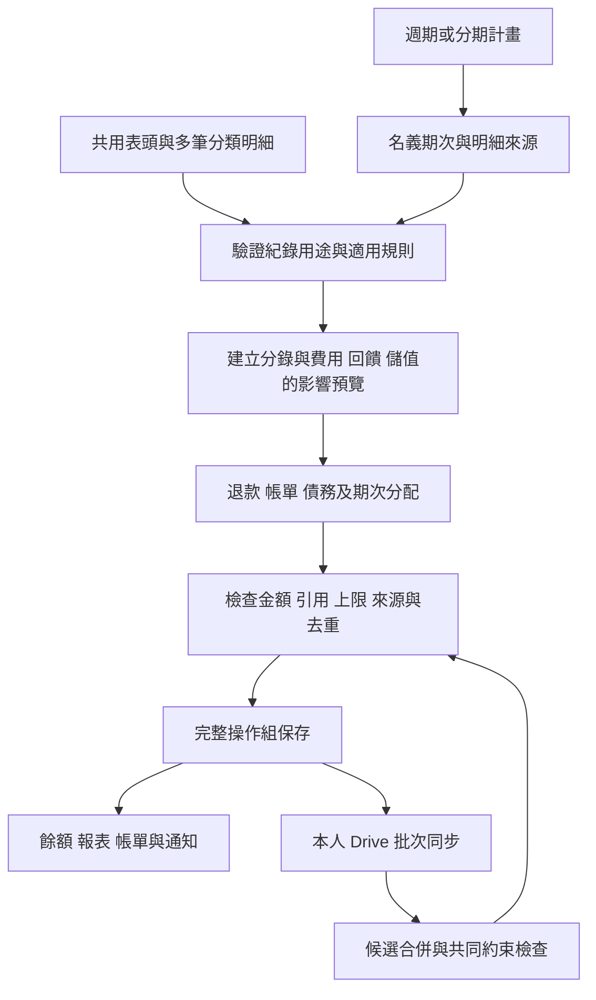

# 網頁記帳程式需求報告：完整審查與設計對應

> 現行授權政策已更新為 v0.5：短期 token 可存 sessionStorage；原文 memory-only 為歷史決策。詳見 [分頁授權恢復](../development/google-session.md)。

> 歷史審查：本文針對 v0.2，保留當時的問題分析及建議。相關決策後續已整合至 [v0.4 需求報告](../requirements/system-analysis-and-requirements.md)；文中的本機預設、離線入帳及待確認狀態不作為現行規格。

審查日期：2026 年 10 月 1 日｜審查基準：需求報告 v0.2｜性質：需求、帳務規則與系統設計審查。

原文件：[網頁記帳程式系統分析與需求報告](../requirements/system-analysis-and-requirements.md)。本文件保留原報告作為比對基準，另列審查結果與可回寫的修訂方案；下列「建議」尚未變成使用者已確認決策。

## 1 審查結論與範圍

原始功能清單已大致完整對應，架構方向可行；但跨功能的帳務語意、分配關係及同步衝突尚未全部定義完成。v0.2 可以作為需求基準與 M0 驗證輸入，尚不能視為完整、無歧義的開發定稿。

本次逐章檢視 22 章、3 個附錄、14 個功能模組及 56 個驗收情境，並回溯對照使用者原始需求與後續確認。結果分成三種：已覆蓋且可沿用、已有原則但缺少操作契約、同一功能在不同章節的規則需要統一。沒有把尚未實作的功能列為測試通過。

| 檢查項目 | 結果 |
| --- | --- |
| 帳戶分組 | 十種皆保留；「儲值卡」名稱已統一 |
| 帳戶基本與進階開關 | 原始 14 項帳戶欄位皆在第 5 章對應；各開關另有專章 |
| 支出分類 | 12 大類、93 個預設子項目逐項一致 |
| 其他預設項目 | 收入 9、轉帳 5、應收 3、應付 4、系統 5，皆一致 |
| 多筆明細 | 已對應六種類型、表單、模型、分攤及 AT44～AT51；不是只加畫面列數 |
| 已確認邊界 | 純前端、localStorage、個人 Drive 根目錄專用資料夾、無關站提醒、僅自動記帳等均有保留 |
| 驗收編號 | AT01～AT56 連續且無重複；另以十進位及整數核算 23 個代表數值案例，未發現其算術錯誤 |
| 待補設計 | 整理為 R01～R12 共 12 組；另提出 RV01～RV30 共 30 個補充驗收情境 |

這次未連接使用者的 Google Drive、未執行實際銀行操作，也未執行產品程式。平台能力以 Google／MDN 官方文件核對；同步演算法與帳務規則的正確性仍須由後續原型及整合測試驗證。

## 2 功能、設計、資料與驗收對應

「已覆蓋」表示有需求及對應設計文字，不代表完整功能已實作。右欄指出進入該模組實作前須補齊的關係。

| 功能 | 報告章節 | 主要資料與責任 | 現有驗收 | 審查結果 |
| --- | --- | --- | --- | --- |
| FR01 本機與雲端 | 14～16、19 | OperationBatch、DriveBinding、SyncState；保存、同步、還原 | AT01、30～43、50～51 | 已覆蓋；補 R07～R10 的同步與保存契約 |
| FR02 幣種 | 3～4、17 | Currency、ExchangeRate；精度、原幣／入帳幣、估值 | AT05～06、39 | 已覆蓋；跨幣退款補 R01，精度異動補 R12 |
| FR03 帳戶 | 5～9、17 | Account、AccountPolicy、Book.defaultAccountId | AT02～03、07～09、20～23、54、56 | 欄位完整；群組設定優先序及資源生命週期補 R04、R10 |
| FR04 分類 | 10、附錄 A～B | Category；類型、樹、種子版本、封存 | AT02、44～46、50、55 | 預設完整；自訂深度及歷史葉節點補 R12 |
| FR05 六種紀錄及明細 | 3、10、17～18 | Transaction、TransactionLine、JournalEntry、Posting | AT03～05、28～29、40、44～51 | 主體正確；退款例外、排程用途、撤銷補 R01～R02、R05 |
| FR06 轉帳及退款 | 3、9～10 | 雙邊分錄、LineAllocation、原單關聯 | AT04～05、22～23、40、45～46 | 一般轉帳可沿用；跨幣退款與無原單型別補 R01 |
| FR07 信用帳務 | 6、12～13、17 | CreditLimitGroup、StatementGroup、Statement、StatementAllocation、CreditReservation | AT08～14、27、30、56 | 原則完整；欠款來源、群組政策及日內順序補 R04、R11 |
| FR08 回饋 | 7、10、12、17 | Rule、RewardAccrual、LineAllocation | AT15～19、27、47 | 設定完整；事件種類、分期次數及跨期退款補 R03 |
| FR09 自動儲值 | 8、10、13 | AccountPolicy、來源轉帳、回饋與生成識別 | AT20～21、48、53 | 三種算法符合確認；專用回饋及解除關聯補 R03、R05 |
| FR10 週期及分期 | 10～13、17 | RecurrenceRule、InstallmentPlan、ScheduleOccurrence | AT24～27、30、39、49、52 | 欄位保留；用途、期次身分、匯入舊分期及首期覆寫補 R02、R06、R11 |
| FR11 應收應付 | 3、10、12、17 | Obligation、SettlementAllocation、資金分錄 | AT28～29、37 | 借還本金正確；貸款排程、報帳核准及代表帳戶補 R02、R12 |
| FR12 通知 | 6、8、13、18 | Notification；有效事件、去重、已讀狀態 | AT14、21、30、39 | 不關站執行符合確認；持續前景與補執行順序補 R11 |
| FR13 總覽與報表 | 3～4、10、18～19 | 從有效 Posting 與分配重建，不重算主紀錄摘要 | AT03～08、12、28～29、44～49、56 | 基本口徑可沿用；匯兌差額、衝突及應收應付納入補 R01、R07、R12 |
| FR14 資料完整性 | 3、14～17、19 | 版本、操作組、去重、快照、引用檢查 | AT31～40、50～51 | 已建立重要不變條件；仍須補具體失敗處理與復原狀態，見 R05、R07～R10 |

### 2.1 原始欄位與選項逐組核對

| 原始需求組 | 覆蓋位置 | 核對結果與應補關係 |
| --- | --- | --- |
| 縮圖、名稱、備註、幣種、分組、期初額 | 4～5、16.4 | 皆有；縮圖完整匯出另補 R10 |
| 帳期、信用、主帳戶、回饋、低額、儲值、國外費、納入總額 | 5～9 | 皆有；預設帳戶、額度代表及帳單代表應保持三個不同角色 |
| 外匯／加密貨幣／自訂、TWD 預設、常用幣 | 4 | 皆有；常用清單是種子，不能把代碼或顯示名稱當唯一 ID |
| 結帳 1～30 日／月初／月底、到期兩種模式 | 6.1～6.2 | 皆有；0 日到期與結帳日結束之間的時間順序補 R11 |
| 信用額度、額度共用及代表、折抵、自動繳款來源 | 6.1～6.4 | 皆有；StatementGroup 合併後不能同時跑成員各自繳款，補 R04 |
| 回饋三種方式、三種計算區間、四種入帳時機 | 7.1～7.3 | 皆有；來源事件不能全部限定消費，補 R03 |
| 回饋當月／次月／次次月、1～30 日／月初／月底 | 7.1、7.3 | 皆有；明確區分活動資格日期、計算區間及實際回饋日期 |
| 累積、單筆、次數三種門檻 | 7.1～7.2 | 皆有；單筆低消先決定哪些事件可累積，補 R03 的順序 |
| 單筆及總額四種進位、單筆及總額上限 | 3.1、7.1～7.2 | 皆有；不同回饋幣種須在同一規則單位計算 |
| 基本回饋、回饋帳戶、專案、活動起訖與內容 | 7 | 皆有；基本與活動疊加、互斥明示符合確認 |
| 低餘額、三種儲值、來源、固定額、補到目標及儲值回饋 | 8 | 皆有；T 與 G 分離、以整筆消費後餘額判斷正確 |
| 國外費率、四種進位、退費選項 | 9 | 皆有；原本金、實際退款及退費必須分幣種檢查，補 R01 |
| 六種類型、分類自訂及完整預設子項目 | 10、附錄 A～B | 皆有；借款等文字分類不自動變成債權流程，原文已說明 |
| 分類、金額、名稱、帳戶、商家、日期、時間、發票、隨機碼、備註 | 10.1、10.6 | 皆有；明細分類／名稱／金額，其他共用；原幣與入帳幣需明確分欄 |
| 立即／提醒／延後／帳單折抵 | 10.2 | 皆有；帳單折抵應保存在帳務用途欄，排程入帳方式獨立保存 |
| 週期間隔、指定日、起始期、有限／無限次、工作日 | 11 | 皆有；應發日與實際處理時間已分離 |
| 分期間隔、起始期、期數、本利、進位、每期及首期金額、尾差 | 12 | 皆有；中途開始及首期鎖定的算法尚須定稿，補 R06 |
| 分期入帳方式、工作日、寬限期、每期／首期回饋 | 12 | 皆有；不同交易方向及回饋計次補 R02～R03 |
| 轉帳匯率、雙邊金額、費用、折扣 | 10.3、10.7 | 皆有；費用扣款帳戶與主轉帳帳戶對是不同關係 |
| 每筆包含多筆子項目 | 10.6～10.7、17～18 | 已貫穿表單、分錄、分期、退款、回饋、儲值及同步；多筆明細不改分類深度 |

## 3 十二組需要補齊的設計

P1 表示進入相關帳務或同步模組實作前需定義，否則不同開發者可能得到不同金額或紀錄。P2 表示上線前須補足的保存、操作或規格完整性。以下均是文件層級發現；「未定義」不等於現有程式已發生錯誤。

### R01｜P1｜外幣退款的上限與入帳金額不能共用一個金額欄

位置：第 9、10.3、10.7、17 章；相關 AT22～AT23、AT46。

第 9 章允許退款採不同實際匯率；第 10.7 節又規定不能超過原明細淨本金，卻未指定比較哪個幣種。原消費 100 USD，帳戶扣 3,200 TWD，全額退款實收 3,500 TWD。如果以原帳戶幣 3,200 作上限，就會拒絕合法的 100 USD 全額退回；若只放寬上限，又可能容許原幣超退。

建議把「退回原交易本金」與「實際收款」分開保存：原單 lineId、原交易幣、退款原幣本金、實際收款帳戶／幣種／金額、原成本回沖額、匯兌差額、費用退回。原幣累計退款不得超過原幣淨本金；原費用累計退回不得超過原實收費用；實際收款額可因匯率不同而變動。

建議本例沖減原分類支出 3,200、收款 3,500、匯兌差額 +300，差額獨立呈現，不把它當成多退 300 本金。退款回到其他幣種帳戶時也依此分離。若要採現金收支口徑直接沖減 3,500，必須另明訂報表政策，不可兩種作法混用。

第 10.3 節允許無原單退款，第 10.7 節卻要求每行選原 lineId。應明訂兩種資料變體：有原單須檢查上限；無原單須有原因及報表分類，不得偽造來源。無原單退款沒有可追溯規則時，不自動追回原交易回饋或退費。

### R02｜P1｜排程必須指定「產生新交易」或「結清既有款項」

位置：第 10～12、17 章；相關 AT24～AT29、AT49、AT52。

收入、應收、應付、系統都被允許共用進階設定，但各自使用分期時的帳務意義沒有完整對應。借入 12,000 建立一次應付後，分 12 期償還，不能每一期再次建立 1,000 的借入。應收的分期收回也不能再次借出。收入分期中的利息更不能套用支出分期的利息支出方向。

建議分開紀錄的三個面向：recordType 表示六大類入口；purpose 表示消費、借入、結清等帳務用途；scheduleAction 表示建立新事件或結清既有 Obligation。應收／應付初始建立、後續結清及利息分錄有不同命令，排程必須選定其中一個。詳見第 5 節適用矩陣。

另需統一身分：週期每期是新的經濟事件；同一消費分期的各期則共享 purchaseId，但各有 occurrenceId、transactionId 與行來源對應。模板本身不再額外入帳；原始購買總額只保存為計畫與分析資料。狀態放在各期事件，計畫用未開始／進行中／完成／終止表示，不能用一個「已入帳」旗標代表所有期數。

### R03｜P1｜回饋需要區分消費與儲值來源，並定義分期計次

位置：第 7.2～7.3、8.2、10.7、12、17 章；相關 AT15～AT19、AT27、AT47。

第 7.2 節預設排除轉帳，第 8.2 節又要求儲值轉帳能產生回饋。兩者可以共存，但規則目前缺少明確的適用事件欄位，開發者可能把儲值回饋一起排除，或讓所有普通轉帳也產生回饋。

建議 Rule 增加 eligibleEventKinds，例如 purchase、topup；預設消費規則不適用普通轉帳，儲值設定所選的專用規則明確適用 topup。儲值回饋的基數為該次成功轉入本金，是否改採來源實扣額需另有設定。儲值產生的回饋不再遞迴觸發儲值或回饋本身。

分期另分三件事：計算回饋金額用每期本金或首期全額；消費次數用同一窗口內不同 purchaseId；固定每筆回饋的「筆」究竟是原消費或每期。建議預設按原消費一次，若活動按每期給固定額，必須明示。週期交易則每期有新的經濟事件 ID，不應因來自同一模板而永遠只算一次。

門檻順序應寫成：先排除不適用明細及退款 → 在單筆事件上判斷低消 → 符合低消的事件才加入累積金額與次數 → 判斷區間門檻 → 追溯該區間合格事件 → 個別計算、進位與上限 → 區間進位與上限。跨月退款回到原回饋窗口修正資格，但追回紀錄使用實際處理日。跨帳戶上限、互斥同優先序及暫發回饋須有穩定排序與版本。

### R04｜P1｜帳單需要可追蹤的欠款來源與群組設定優先序

位置：第 6、17 章；相關 AT08～AT14、AT56。

報告已說明結轉不得重複計算，但模型只列 Statement 及來源付款分配，尚未明訂「哪一筆未付欠款」是唯一被清償的對象。上期未付 1,000、下期新消費 500，下期畫面顯示 1,500 時，若兩張帳單各自剩餘額都能被自動繳款，可能對同一 1,000 建立兩次付款。

建議 StatementItem 引用穩定 postingId 或 debtItemId；不同帳期的結轉顯示引用同一未清項目。StatementAllocation 保存來源可用額、目標欠款項目及對應帳戶。清償上限同時檢查付款來源、欠款項目與帳單分配，不只檢查付款來源。總未付只對唯一欠款集合求和。

StatementGroup 必須定義成員只屬於一個有效合併群組、加入及退出生效帳期、帳期與到期日繼承、代表帳戶角色、單一自動繳款政策。加入後成員原有自動繳款不得和群組繳款並行；歷史獨立帳單保留。群組內付款如何分配成員、A 卡正向餘額能否抵 B 卡欠款，必須有明訂政策及分錄，不能只移動畫面數字。合併繳款以同一操作組提交多筆各有一組帳戶對的轉帳，不把不同信用帳戶混進單一主紀錄的明細。

第 6.1 節「已入帳未清償借方餘額」容易與負債科目方向混淆。建議改為「已入帳信用欠款金額」，並在本系統的帶正負號模型中定義為依政策計算的欠款正值。額度計算使用帳戶欠款與保留額，不加總所有帳單的展示額。

### R05｜P1｜整組撤銷與保留衍生紀錄，需要明確的解除關聯操作

位置：第 3.3、8.2、10.5、10.7、14～17 章；相關 AT19、AT21、AT40、AT51。

第 10.7 節說全部明細與衍生分錄同時撤銷，第 8.2 及 10.5 節又允許保留儲值為獨立紀錄、回饋改為手動。若沒有明確的解除關聯狀態，下次重算可能把保留項再次產生，或仍被來源交易撤銷。

建議將「一次操作原子保存」與「來源關係」分開。費用、回饋、儲值各自是有穩定 ID 的紀錄，透過 DerivationLink 保存來源、規則、生成識別及模式 managed／detached／suppressed。解除管理仍保留歷史來源；同一生成識別標成已由手動紀錄承接，防止補算再生。已入帳結果以沖銷與修正版處理，不刪原分錄。

跨期追回回饋是新的調整操作，並不是回頭修改原始已上傳的不可變 OperationBatch。撤銷來源時先建立完整影響計畫：保留哪些實際金流、沖銷哪些自動項、釋放哪些保留額、重新分配哪些帳單，再一次提交。退款代表後續經濟事件，不能默認等同刪除原消費。

### R06｜P1｜分期中途開始、首期覆寫與尾差位置尚有兩種解讀

位置：第 11～12、22 章；相關 AT24、AT26、AT49、AT52。

起始第 3 期、共 12 期的「共生成 10 期」已明確，但分期金額的分母仍須定義。原本金 12,000、總利息 120、原本每期 1,000＋10，從第 3 期接手時應保留剩餘本金 10,000、利息 100；不能把剩餘 10,000 再除以原 12 期，也不能重新保留已繳的本金額度。

建議分成「完整原計畫接手」與「重新安排剩餘款項」。前者保存原本利表及第 1～2 期已處理狀態，剩餘只生成第 3～12 期；後者輸入剩餘本金／利息及剩餘期數，建立明示的新計畫。已有期初信用欠款與剩餘分期保留額也需對帳，不能重覆入帳。

原文遇到首期固定值與首期尾差衝突，會把尾差改放最後可調整一期。這會使使用者選擇的尾差位置失效。建議選項互斥驗證：首期本金或利息鎖定時，若無法容納其尾差，要求改選可調整期次或解除固定值，不能暗中換政策。保存最終本利表及實際尾差期次，不只保存進位 enum。

寬限期已有標示待確認，但「只延後首期」與「整期順延」仍可能分別被理解為只改第一個日期或整份計畫往後移。建議定義為移動首期錨點，再依間隔生成後續所有期次，保留名義日及短月回退規則；本金與輸入總利息不變。這是待定稿建議，不取代使用者既有的本金加總利息模式。

### R07｜P1｜同步衝突要檢查共同約束，不能只看同一 transactionId

位置：第 16.3、17 章；相關 AT13、AT18、AT33～AT35、AT51。

報告已要求合併後重驗證額度與上限，這個方向正確；但尚未定義不同實體違反共同上限時，應撤回哪個結果、停止什麼、如何恢復。原消費可退 100，A、B 裝置離線各建立一筆不同 ID 的退款 80；兩筆不是「同一交易被同改」，卻會形成累計 160。兩筆付款分配同一帳單、兩個自動事項使用同一不足的來源帳戶，也有相同問題。

建議下載批次先進候選區，再驗證相關的原單 lineId、欠款來源、Obligation、來源帳戶、自動生成識別及回饋上限群組。驗證完成才形成有效帳務投影；衝突資料完整保留，相關總覽標示未解決，自動事項暫停。不能把候選資料一律加進餘額，稍後再希望人工修好。

同一狀態、同一批次集合必須得到相同結果；同步到達順序或裝置時鐘不能決定金額。若兩筆都代表實際付款，應保留真實金流，讓超額部分成為未分配款或依明確用途處理，不能為了滿足分配上限而刪除付款。自動生成且互斥的候選事件則等待選擇，不擅自宣稱兩筆都成功。

跨裝置合併在離線期間無法保證所有畫面已一致，因此「已存本機」「已上傳」「已驗證合併」需分開。相同自動事件 ID、相同內容是去重；相同 ID、不同內容是版本衝突。保存解決操作及被取代版本，防止舊裝置再次帶回被否決結果。

### R08｜P2｜Drive 連線不能解決完整 localStorage 日誌持續增長

位置：第 15～16、19～20 章；相關 AT31、AT37、AT50。

原文已正確提醒 localStorage 配額並要求容量測試。尚欠的是「達到容量上限後，產品仍可提供哪些操作」。若本機仍保存全部不可變操作、分錄與縮圖，把相同資料同步到 Drive 不會增加本機容量。相同 origin 下的不同 Google 使用者命名空間也共用 origin 配額，並非每位使用者各有一份額度。[MDN 儲存配額](https://developer.mozilla.org/en-US/docs/Web/API/Storage_API/Storage_quotas_and_eviction_criteria)

建議 M0 明訂有界的 localStorage 使用模式：量測包含操作歷程及圖片的實際序列化資料；先清可重建快取；容量不足時保留編輯內容、允許匯出與唯讀，停止新的正式提交。雲端連線成功不能讓容量警示自動消失。

若要支援更大資料量，另實作使用者選擇的 IndexedDB 遷移，或有明確裝置確認與復原契約的歷史封存；兩者都不擅改「預設 localStorage」。MVP 不自動清除未確認操作與刪除標記是合理選擇，但要把容量邊界寫入完成條件。不能一面承諾永久保存所有日誌，一面暗示任意多年資料都能存於 localStorage。

### R09｜P1｜首次 Drive 同步需要補齊游標、分頁與切換帳號的契約

位置：第 16.2～16.4、17 章；相關 AT33～AT36、AT41～AT43。

原文列出列舉、增量變更與再次拉取，但沒有明訂首次全量掃描和開始游標的取得順序。若先掃描，最後才取得目前游標，掃描期間新增或刪除的批次可能落在兩個步驟之間而漏掉。

建議工程流程為：先取得變更起點 C0 → 完成資料樹分頁列舉 → 下載並驗證候選資料 → 從 C0 重播增量直到最後一頁 → 成功保存已處理資料後才提交新游標。重複出現檔案以 fileId／batchId 去重；失敗不得提早推進游標。若先保存批次後來不及保存游標，下次重播仍安全。這是依官方游標能力提出的應用層方案，需並發原型驗證，不是 Google 提供的原子快照保證。[Google Drive 變更追蹤](https://developers.google.com/workspace/drive/api/guides/manage-changes)

Drive 沒有在此方案中替應用遞迴列舉整棵帳本資料樹；必須追蹤 books、operations、snapshots、assets 等資料夾 ID，或用已驗證的檔案標記列舉後檢查歸屬。收到已知 fileId 的移出或刪除不能丟掉，失去存取權也不能直接當作使用者要求刪除所有帳務。

帳號切換除取消同步工作外，每個非同步回應都要帶本機 sessionEpoch 與所有者綁定檢查，避免 A 的延遲下載結果在切換 B 後更新 B 的畫面、快取或游標。穩定 Google 使用者識別的取得 API、必要 scope 及 owner 檢查需在 M0 驗證，不能只有資料模型欄名。

drive.file 允許操作應用可存取的特定檔案，適合此需求；它不是整個根目錄的廣泛讀寫權限。新裝置搜尋、同意撤回後重連、外部搬入備份檔案及多人同名資料夾，應以真實授權環境驗證。[Google Drive scopes](https://developers.google.com/workspace/drive/api/guides/api-specific-auth)

### R10｜P2｜完整備份要包含圖片，也要區分還原帳本與複製連線

位置：第 5、15～17 章；相關 AT37～AT38、AT42。

第 16.4 節把縮圖二進位資源存 assets，帳務只保留 assetId／fileId；第 15 節的完整 JSON 匯出未明訂圖片內容。若只有 Drive fileId，原檔被刪後，就無法靠匯出檔還原帳戶縮圖。

建議完整備份包含 manifest、帳本資料與實際資源內容，可採打包檔或內嵌小型圖片；記錄 MIME、位元組大小、雜湊與引用。資源若無法取得，匯出應明示缺項，不能標成完整。CSV 維持分析用途。補 Asset 邏輯實體，管理本機內容、雲端 ID、上傳狀態、刪除引用與復原。

還原分成「復原原帳本」與「建立副本」。同一本帳本保留經濟事件 ID、已處理期次及撤銷狀態，避免還原後把歷史自動繳款再執行一次；副本以新 bookId 隔離。token、裝置 ID、同步游標與 DriveBinding 不直接視為可攜帳務資料套到新裝置或另一使用者。原外部 fileId 只能作來源資訊，須重新取得授權並建立目的資源對應。

純前端無關站工作，因此「7 個日版本、4 個週版本」應定義為有開啟且成功保存時形成的版本保留策略，不能保證關站期間每日都有新快照。快照只有在資料及依賴資源均可還原時才標記完成。

### R11｜P1｜同日執行、結帳截止與補記需要統一時間順序

位置：第 3.3、6.2～6.4、7.3、11～13 章；相關 AT09～AT14、AT25、AT30、AT39。

既有日期規則大致一致，但事件順序尚未完整定義。例如到期日同時有退款、回饋與自動繳款，若先繳款再讀入折抵，會生成不同金額。原文同時允許結帳後 0 日到期、又把結帳當日全天算入帳期；需要先解決「帳期尚未結束卻已要求繳清」的時間矛盾。

建議保留兩種時間：帳務生效時間與系統處理時間。每次補處理先完成可取得的同步與衝突檢查，再按名義日期及明確依賴排序：已知交易與各期入帳 → 合格調整／回饋 → 達截止的結帳與帳單分配 → 到期繳款 → 通知。儲值前／後順序在單一消費操作內處理。不能只以檔案下載先後決定。

在早上自動繳款後才新增的當日退款，仍是新的正向餘額與可分配金額；不可自動改寫已建立的繳款來假裝早上已知道退款。若希望到期日結束後才統一算全日折抵，須將執行時點明示為日終補處理，屬不同政策。建議採當次執行時已知資料，剩餘正向金額保留人工分配，維持使用者已確認的期限當日資格。

結帳後補登前期資料需保留原帳單快照，另建帳單調整與版本，重新計算未付及提示，不靜默改寫歷史。0 日到期並非使用者原本指定的必要選項，建議初版移除這個補充建議、採至少 1 日；若保留，須另定義結帳與到期時刻。

持續停留前景而沒有其他操作時，也要以輕量計時器檢查最近到期點；恢復前景仍補檢查。不要求背景分頁準時，也不增加關站後提醒。計時器只是觸發檢查，判斷仍依保存日期與去重狀態。

### R12｜P2｜需要集中決策索引與畫面適用條件，避免建議被當定稿

位置：第 4～8、10～12、18～22 章。

第 22 章集中列出寬限期及分類深度兩項待確認，但內文還有報帳認列、溢繳額度、回饋追回不足、首期覆寫及部分進階功能限制等產品選擇。這些已有建議，並非沒有思考；問題是沒有統一的狀態索引，開發者容易把它們當成已确認。

建議每項政策保存決策編號、狀態、建議預設、生效版本、對應欄位與驗收。表單依用途控制欄位：信用帳期使用群組或個別政策、帳單折抵是正向調整用途、貸款分期是結清計畫、自動規則產生的系統紀錄不能再任意巢狀排程。功能尚未上線時不顯示為已生效。

分類原本是一個已使用的葉節點，新增子分類後，歷史紀錄仍應保留原 categoryId；只對後續新增要求選新葉節點。幣種精度變更不能重新解讀既有整數金額，應保存金額精度或限制有歷史幣種修改。報表要對「排除總餘額帳戶」「內部應收應付」「代表其餘額的帳戶」有單一納入政策，以防重算或漏算。

此項不要求一次增加所有設定開關；先把必要政策寫成明確預設與版本，只有使用者需要調整的項目才呈現於介面。

## 4 建議統一的資料關係與執行契約

以下是可回寫第 14～17 章的設計草案。這些是邏輯關係，可以序列化為巢狀物件，不要求新增後台或關聯式資料庫。

流程圖中的同步重驗證不代表重新執行已生效的經濟事件；重建投影及去重後，只對新的必要調整產生新操作。

| 關係 | 必須成立的設計契約 |
| --- | --- |
| Book → Account | Book 保存唯一 defaultAccountId；帳戶分組與信用開關獨立 |
| Account → CreditLimitGroup／StatementGroup | 額度群組與帳單群組分離；預設帳戶、額度代表、帳單代表、繳款來源互不代替 |
| Transaction → TransactionLine | 至少一行；共同帳戶、幣種、日期；摘要總額不再獨立過帳；lineId 不因排序變動 |
| Transaction → JournalEntry → Posting | 一次生效或沖銷可追溯；計畫摘要、主紀錄及明細不能各自再列一份金額 |
| RecurrenceRule → Occurrence | 每期是不同經濟事件；同一期同一生成識別，改規則只修訂，不多生一筆 |
| InstallmentPlan → Occurrence → LineAllocation | 各期共享原消費識別；本金與利息分開，明細橫向與期次縱向各自守恆 |
| Refund → OriginalLine | 有原單必須有原幣本金上限；實收幣金額、退費、匯差分開；無原單有專用變體 |
| Statement → StatementItem → Posting | 帳單引用唯一欠款來源；結轉不再造負債；付款額及欠款額雙向檢查 |
| PaymentOperation → Transfers → StatementAllocation | 合併帳單可用同一操作組保存多筆轉帳；每筆轉帳仍只有一組帳戶對 |
| Obligation → SettlementAllocation | 初始借出／借入只建立一次；後續還本減少未結清，利息另生系統紀錄 |
| RewardRule → RewardAccrual | 用明示事件種類、窗口、單筆識別、計次識別、規則版本重建結果 |
| Source → DerivationLink → DerivedTransaction | 自動管理、已解除管理、已抑制分開；保留歷史來源但不重複生成 |
| Account／Transaction → Asset | 二進位內容與引用都有生命週期；完整備份不能只有外部 fileId |
| OperationBatch → Conflict → Projection | 雲端已存在不等於可立即生效；先處理版本及共同約束，再更新有效帳務 |

### 4.1 最少需要補入的欄位

| 位置 | 建議補明的欄位或物件 | 解決的問題 |
| --- | --- | --- |
| Transaction／ScheduleOccurrence | purpose、economicEventId／purchaseId、templateId、occurrenceId、originalDate、effectiveAt、processedAt | 排程、分期、計次及實際處理日分離 |
| 金額結構 | currencyId、精度、精確值；原幣本金與帳戶幣實際額分開 | 幣種精度及外幣退款 |
| RefundAllocation | originalLineId、原幣退本、成本回沖、實收、匯差、退費 | 退款上限與報表不混淆 |
| StatementItem／Allocation | sourcePostingId 或 debtItemId、原帳戶、未清償額、來源付款／折抵引用 | 逾期結轉、合併帳單及部分繳清 |
| InstallmentPlan | originalPrincipal、originalInterest、periodTable、startPeriod、settledPeriods、remainingPrincipal、remainingInterest、lockedFirstAmounts | 中途接手與尾差可重建 |
| RewardRule | eligibleEventKinds、qualificationDateBasis、windowKey、amountBasis、countBasis、fixedRewardBasis、capGroupId、priority | 儲值回饋與分期計次 |
| DerivationLink | sourceId、derivedId、generationKey、ruleVersion、managementMode、replacementRef | 改為手動及撤銷不再生 |
| SyncState／Conflict | ownerBinding、sessionEpoch、committedCursor、候選批次、衝突引用集合、解決操作 | 切換帳號、游標安全、跨實體衝突 |
| Asset／BackupManifest | assetId、MIME、大小、雜湊、內容位置、引用、完整性、backupVersion | 圖片可攜與還原完整性 |

這是需寫清楚的契約清單，不是要求每個英文名稱都直接採用。既有欄位若已可完整表達，應整合並避免存兩份可互相矛盾的狀態。未付金額、餘額與規則結果都要能由有效來源及分配重建。

## 5 六種類型與進階功能的適用矩陣

這張表補足「相關設定參考支出紀錄」容易產生的歧義。屬建議規格，沒有藉此刪除原本收入、應收、應付及系統可使用進階設定的需求。

| 紀錄用途 | 基本帳務效果 | 週期 | 分期 | 回饋、費用與折抵 |
| --- | --- | --- | --- | --- |
| 支出／消費 | 資產減少或信用欠款增加，列費用 | 每期新消費事件 | 同一消費分攤；信用本金保留及逐期釋放 | 依規則回饋、國外費及儲值；帳單折抵入口切為正向調整 |
| 收入 | 資產增加或信用欠款減少，列收入 | 每期新收入事件 | 同一收入分次入帳；有息項的利息為收入 | 扣款費用另列；入信用帳戶可依資格折抵；不預設觸發消費回饋 |
| 一般轉帳／提款／存款／兌換 | 雙邊本金移動，不列收入支出 | 可作資金移動排程的擴充，需明示支持範圍 | 原轉帳需求未要求，不能因共用表單誤開啟 | 費用及其折扣分開；普通本金無消費回饋；儲值為專用事件 |
| 商家退款 | 收款並沖原支出或指定用途 | 關聯退款若要排程，每期仍受同一原單餘額上限 | 分次退款亦須先定義原單分配，不套消費分期模型 | 原費用退回、原回饋調整、信用帳單分配；無原單有明示例外 |
| 應收建立：借出／代付 | 資金流出，建立應收本金 | 每期新借出代表每期新債權 | 初始借出可分批，與「分期收回」是不同用途 | 代付不可同時列個人支出；利息收入獨立 |
| 應收結清：收回 | 資金流入，降低既有應收 | 排程收回同一或選定債權 | 分期收回本金加利息，不重建借出 | 本金不列收入；利息列收入；可部分收回、多對多分配 |
| 應付建立：借入／貸款 | 資金流入，建立應付本金 | 每期新借入代表新債務 | 分批撥款與「分期還款」是不同用途 | 本金不列收入；費用另列 |
| 應付結清：還款 | 資金流出，降低既有應付 | 排程還款而非新借入 | 原本金及總利息分攤，連回既有債務 | 本金不列支出；利息列支出；同一資金帳戶內可共用操作組 |
| 系統：手動費用／回饋／利息／折扣 | 依每行用途決定方向與報表 | 保留排程能力，須有明確用途 | 可分攤原系統金額，但不再產生分期利息的無限巢狀 | 正負項分列；折扣須指向受調整來源或有明確無原單用途 |
| 系統：規則自動生成 | 由來源規則決定 | 使用來源排程，不再附加另一套自動排程 | 使用來源分配，不重複攤分 | 改手動前解除管理與保留生成識別 |

所有可用型態都維持一筆主紀錄內共用帳戶、幣種與日期。應收應付結清或合併帳單需要多個帳戶時，以一個應用操作提交數筆各自合法的紀錄，不能突破使用者已確認的單筆明細限制。轉帳手續費可由第三帳戶支付時，費用同樣是關聯的獨立系統紀錄。

UI 須另有欄位適用表：什麼條件顯示、是否必填、切換時如何處理已填值，以及哪些設定因群組繼承而唯讀。隱藏欄位不應偷偷繼續生效；已形成歷史資料的設定則保留原快照。

## 6 待定稿政策的集中索引

以下不要求現在逐題回覆；審查工作已先給出建議方向。工程團隊應在對應模組開工前把採用值寫回主報告，不能將尚未採用的建議標成使用者已確認。

| 編號 | 待定稿政策 | 建議方向 | 決策位置 |
| --- | --- | --- | --- |
| D01 | 外幣退款的分類金額與匯差 | 原成本沖減支出，實收差額另列匯兌調整 | R01；帳務核心前 |
| D02 | 分期固定回饋與消費次數 | 區間計次按原消費；固定每筆預設原消費一次，每期給付另明示 | R03；回饋前 |
| D03 | 儲值回饋基數 | 成功轉入本金；不把失敗、費用或回饋本身算入 | R03；儲值前 |
| D04 | 群組帳單的分配及設定繼承 | 群組統一日期與自動繳款；引用成員欠款；人工分配可保留 | R04；信用前 |
| D05 | 溢繳與可用額度 | 預設不提高核定額度；是否跨成員抵欠款另明訂 | R04；信用前 |
| D06 | 解除自動管理的後續重算 | 保留已存在的手動結果及來源，不再次生成同一項 | R05；帳務核心前 |
| D07 | 首期金額與首期尾差衝突 | 不自動改尾差位置；要求選相容設定後保存確定本利表 | R06；分期前 |
| D08 | 寬限期日期 | 首期錨點與後續期次一起順延；本金、總利息不變 | R06；分期前 |
| D09 | 自動繳款日內時點與 0 日到期 | 執行時已知資料決定金額；後來退款不回寫付款；初版不提供結帳後 0 日 | R11；信用排程前 |
| D10 | 回饋追回後點數不足 | 建議允許負點數並提醒；若禁止，須有可追蹤的待追回額，不能直接忽略 | R03、R12；回饋前 |
| D11 | 自己支出後報帳 | 已核准部分轉為應收並沖減相應支出；真正補助另作收入，不建第二次現金流 | R02、R12；應收應付前 |
| D12 | 自訂分類最大深度 | 預設層數不變；保留自訂子分類，最大深度作獨立產品限制 | R12；分類前 |
| D13 | 納入總額與應收應付代表帳戶 | 每項債權債務只有一個總覽歸屬；若使用代表帳戶，排除重複虛擬餘額 | R12；總覽前 |
| D14 | 容量滿時的模式 | 本機有界保存、可匯出及唯讀；更大容量以明示遷移提供 | R08；儲存前 |
| D15 | 自動功能的跨幣及來源限制 | 初版自動繳款／儲值採同幣；手動轉帳支援跨幣；不可把建議限制冒充原始需求 | R12；進階表單前 |

已確認且不得重新推翻的內容：預設 localStorage、無後台、個人 Drive 根目錄專用資料夾、使用者彼此獨立、關站不提醒、不實際移轉金錢、TWD 預設、儲值卡用語、主帳戶是預設選用帳戶、額度與帳單分離、帳單折抵期限含當日、全額自動繳款不足即停止、分期本金加總利息、尾差首／末期、T／G 分離、完整比例級距、固定回饋區分每筆／每區間、基本加活動可疊加、達標追溯全期、週末加自訂假日、手動匯率、六種類型共同的多筆明細模型。

## 7 建議補充驗收案例

RV 編號是本次審查提出的補充案例，並未與原 AT01～AT56 混號。涉及 D 系列政策者，其預期結果依本文件建議值書寫，定稿後應同步修訂。下表是測試規格，尚未在產品中執行。

| 編號 | 情境 | 必須驗證的結果 |
| --- | --- | --- |
| RV01 | 100 USD 消費實扣 3,200 TWD，全退 100 USD 實收 3,500 | 原幣退本 100；原成本回沖 3,200；匯差 +300；不以 3,200 拒絕實收；原單不再可退 |
| RV02 | 原幣 100，分別退 40、60，兩次匯率不同 | 原幣累計恰為 100；手續費按原費用上限處理，最後尾差守恆；再退 1 被拒絕 |
| RV03 | 手動無原單退款 200 | 有原因與分類可保存；沒有偽造 lineId，也不自動猜測原費用或回饋 |
| RV04 | 借入 12,000，分 12 期還本，首期本金 1,000、利息 10 | 初始負債只建一次；首期後本金負債 11,000，資金減少 1,010，費用僅 10 |
| RV05 | 同一薪水週期連續三期入帳 | 三個新經濟事件、三組有效分錄；模板本身沒有第四筆收入；重跑不新增 |
| RV06 | 一筆消費同一回饋窗口入帳兩期，活動須消費 2 次 | 消費次數仍為 1，不因分期達標；回饋金額另依每期／首期政策計算 |
| RV07 | 自動儲值轉入 500，專用回饋 2%；另有普通轉帳 500 | 儲值產生 10 回饋一次，普通轉帳不產生；回饋不觸發再儲值 |
| RV08 | 刪除來源消費，但選擇保留已儲值 500 | 消費沖銷、儲值兩端保留；來源關係可查；重算不再新增或自動沖掉這筆儲值 |
| RV09 | 自動回饋改為手動 20，後續重新計算來源 | 手動值不被覆蓋，同一生成識別不多出另一筆回饋；調整歷程保留 |
| RV10 | 舊帳單未付 1,000，新帳單新增 500 並展示結轉 | 總未付 1,500；對舊欠款繳 1,000 後總未付 500，兩張畫面均反映同一清償 |
| RV11 | 合併帳單 A 卡 6,000、B 卡 4,000，銀行有 20,000 | 一個繳款操作內形成 6,000／4,000 配對轉帳；銀行剩 10,000；群組和成員不重複自動繳款 |
| RV12 | 分 4 期、本金 1,000，首期鎖定 300，又要求尾差首期 | 若不能同時滿足，阻止提交並列出衝突；不靜默改成尾差末期 |
| RV13 | 原本金 12,000、總利息 120、12 期，從第 3 期接手 | 剩餘本金 10,000、利息 100，共 10 期；不補造前兩期，不重占已付本金額度 |
| RV14 | 月付首期 1 月 10 日，寬限 1 個月 | 建議政策下為 2 月 10 日、3 月 10 日依序生成；總期數及本利總額不變 |
| RV15 | 原單可退 100，兩裝置各新增不同 ID 的退款 80 | 偵測共同原單上限衝突；不直接認定可分配本金 160；保留兩版資料並提供實際款項處理 |
| RV16 | 同一回饋群組上限 60，兩裝置各暫發 40 | 合併後有效回饋總額至多 60；多出 20 有可追溯調整，重合併不重複追回 |
| RV17 | 銀行可用 100，兩裝置各自動生成需 80 的不同繳款 | 偵測共同來源不足；不得宣稱兩筆均足額成功；衝突／待處理狀態可還原 |
| RV18 | 首次全量掃描中，另一裝置新增一批次 | 從掃描前游標重播後找到新批次一次，不落在全量與增量的空窗 |
| RV19 | 增量有兩頁，第二頁下載失敗 | 不提交已越過失敗資料的新游標；重試第一頁不重入帳 |
| RV20 | A 的下載未完成即切換 B，A 回應才返回 | B 的畫面、快取、待送及游標完全不受 A 回應影響 |
| RV21 | 完整匯出含自訂縮圖，原 Drive 圖片之後刪除 | 在隔離測試環境還原仍有縮圖與正確引用；缺圖備份不能標示完整 |
| RV22 | 還原一份已自動繳款及已撤銷排程的備份 | 已繳款不再生成，已撤銷不復活；新裝置不直接承接舊 token、DriveBinding 或游標 |
| RV23 | 同一網站的 A、B 本機資料合計達配額邊界 | 容量檢查按 origin 實測；保存失敗不顯示成功；連接 Drive 不誤稱增加本機配額 |
| RV24 | 一筆多行交易及第三帳戶費用保存時配額不足 | 所有帳戶均不留下半筆有效操作；表單可匯出／重試；原分錄保持可重建 |
| RV25 | 帳單 1,000；執行前已知折抵 200，繳款後再新增當日退款 100 | 先記繳款 800；後續 +100 成為可用正向餘額／可分配款；不把原付款偷偷改為 700 |
| RV26 | 已結帳並繳清 1,000，之後補登前期支出 100 | 原快照及付款保留；新增帳單調整 100 並提示；不再次產生原 1,000 繳款 |
| RV27 | 網站持續前景、無操作，跨越一筆提醒時間 | 前景檢查能產生一則通知；重新整理及恢復前景不重複；關站仍不執行 |
| RV28 | 回饋已花完、剩 0，退款須追回 3 點 | 依已定政策形成 −3 或待追回 3；不把差額消失，也不重複追回 |
| RV29 | 收入分期每期本金 500、利息 10 | 帳戶每期增加 510；利息是收入，不出現利息支出，也不再次建立借款 |
| RV30 | 已用收入分類新增子分類，再重新載入舊紀錄 | 歷史 categoryId 保留可識別；新表單依葉節點規則選擇；不自動搬移歷史紀錄 |

除上表外，原 AT01～AT56 必須保留。新增測試不應取代原本的正向流程、工作日、日期邊界、無原單情境、來源不足、同步失敗與多明細驗收。

## 8 開發順序與回寫建議

| 階段 | 審查後應完成的補強 | 可繼續的工作 |
| --- | --- | --- |
| M0 | 決定經濟事件身分及金額結構；驗證 Drive 首次掃描／增量、整組保存、配額、多分頁與跨實體衝突 | 金額、日期、分配核心及同步原型 |
| M1 | 完成 R01、R02 的基本用途、R05 撤銷／解除關聯、R10 匯出還原及 R12 分類／總覽口徑 | 帳戶、完整分類、六種紀錄、多筆明細、手動應收應付及基本報表 |
| M2 | 完成 R07～R10 的帳號隔離、候選合併、游標、容量與備份契約 | 純前端 Drive 連接及跨裝置完整流程 |
| M3 | 完成 R04 帳單來源與群組、R06 完整分期表、R11 日期與補執行順序 | 信用、週期、分期、繳款及站內提醒 |
| M4 | 完成 R03 回饋語意、儲值回饋與跨期修正，跑跨功能案例 | 原需求全部進階功能與完整報表 |

M1 的範圍文字應明列 FR11 的手動債權債務、FR13 的基本總覽及 FR14 的必要保存能力，避免只列 FR02～FR06 卻實際依賴其他模組。M2 的可靠同步亦不能等到完成 UI 後才決定事件 ID 與資料版本；基本資料契約需在 M0 穩定。

建議主報告下一版回寫內容為：修正 R01 的金額定義；補 R02／R03 的用途及識別；補 R04／R05 的分配與生命週期；定稿 R06／R11 的時間及分期例外；補 R07～R10 的儲存同步失敗流程；加入本文件第 5、6、7 節的適用矩陣、決策索引與驗收案例。既有使用者已確認需求維持有效。

完成條件應是每項需求都能追到欄位、唯一運算規則、資料引用、失敗處理與驗收結果；當有產品選擇時，清楚記錄採用值。現階段已有足夠內容開始 M0，優先處理上述資料與帳務契約，再實作相關進階表單。

## 9 平台查核與審查界線

無後台網頁由瀏覽器取得 Google access token、直接呼叫支援 CORS 的 Google API，符合官方 token 模式；token 過期須透過使用者操作重新取得，不能承諾永久無感同步。[Google Identity Services token model](https://developers.google.com/identity/oauth2/web/guides/use-token-model)

localStorage 配額、Drive 檔案範圍及變更游標的官方依據已附在 R08～R09。它們支持平台能力判斷，不替應用保證帳務一致性。R01～R07、R10～R12 的建議均為本產品的設計審查結果，不是銀行通用規則或法定會計準則。

本次已完成全文對照、預設分類與欄位檢查、原 56 個驗收情境逐項閱讀，以及 23 個代表數值案例的算術核算。尚未執行 OAuth 整合、瀏覽器配額、多裝置競態、圖片備份還原或產品端到端測試；這些已列為後續完成條件，不以文件審查代替實作驗證。
