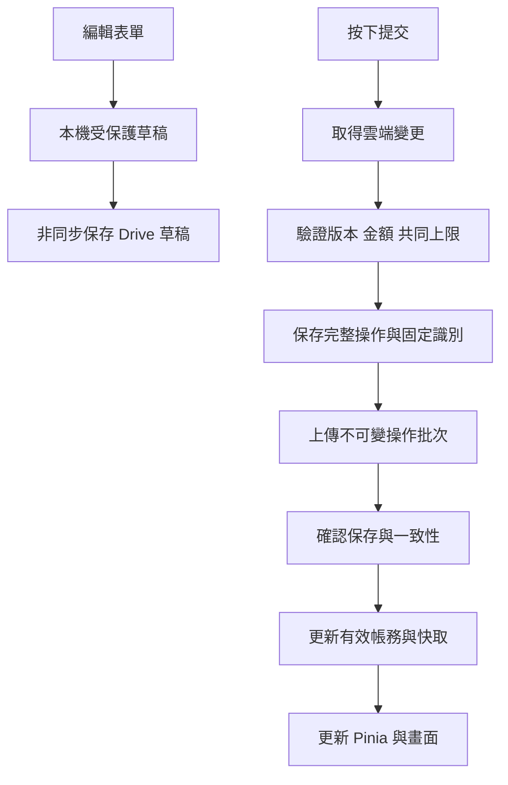

# 技術選型與實作架構

版本：v0.1 技術規劃｜日期：2026 年 10 月 2 日｜需求基準：[系統分析與需求報告 v0.4](../requirements/system-analysis-and-requirements.md)。

本文記錄前期討論的技術建議，作為專案初始化與實作規劃依據。產品功能與帳務語意以 v0.4 為準；具體套件版本及整合可行性須經 M0 驗證。本文是前期規劃，不代表各模組已完成；2026-10-02 已開始 0.1.0 實作，現況請見 [實作進度](../development/progress.md)。PrimeVue 實作固定採 MIT 授權的 4.5.5／主題 2.0.3，具體版本以 lockfile 為準。

## 1 技術組合

採 Vue 3、TypeScript、Vite、SCSS 與 Pinia 建構純前端單頁應用。瀏覽器經 Google 授權直接存取使用者的 Drive；靜態主機提供 HTML、CSS 與 JavaScript。

| 用途 | 建議技術 | 專案責任 |
| --- | --- | --- |
| 介面框架 | Vue 3 | 帳戶、交易明細、信用帳單、回饋及設定頁面 |
| 程式語言 | TypeScript，啟用 strict | 資料型別、用途與狀態的明確契約 |
| 開發及建置 | Vite | 開發伺服器、模組載入與正式靜態檔案打包 |
| 頁面路由 | Vue Router | 總覽、帳戶、紀錄、帳單與設定的網址及導覽 |
| 共用狀態 | Pinia | 目前帳本、已載入查詢結果、選取條件及同步狀態 |
| 樣式 | SCSS、sass-embedded、CSS 變數 | 響應式排版、樣式共用及視覺設定 |
| 通用元件 | PrimeVue | 選單、日期選擇、對話框及表格；採主題 tokens 客製 |
| 執行時驗證 | Zod | 表單、Drive 下載內容與匯入資料的結構及版本驗證 |
| 金額運算 | decimal.js | 十進位計算、匯率、分攤、利息、費用與進位 |
| 日期與時區 | Luxon | 帳本時區及曆日運算；帳務排程政策另由領域模組實作 |
| Google 授權 | Google Identity Services | 瀏覽器 token 模式、重新連接及授權狀態 |
| 雲端 I/O | Google Drive API v3、原生 fetch | 資料夾、操作批次、草稿、快照、備份及圖片 |
| 本機 I/O | localStorage、自行封裝儲存介面 | 有限快取、可攜偏好與受保護暫存 |
| 核心及整合測試 | Vitest | 金額、日期、帳務、版本、去重與同步故障 |
| 操作流程測試 | Playwright | 多明細記帳、斷線恢復、重新授權及衝突處理 |
| 工程工具 | Node.js LTS、pnpm、ESLint、Prettier、vue-tsc | 套件管理、格式、靜態分析與型別檢查 |

Vue 官方提供以 Vite 建立 TypeScript 專案的工具；Vite 打包本身不取代型別檢查，建置流程須另執行 vue-tsc。[Vue TypeScript 文件](https://vuejs.org/guide/typescript/overview.html)。Pinia 用來管理跨元件共用狀態，其責任不等同持久化帳本。[Pinia 文件](https://pinia.vuejs.org/introduction.html)

具體版號在初始化時依相容性選定並寫入 package manifest 與 lockfile。使用穩定版本並固定可重現的安裝結果；本文件不預先承諾尚未驗證的版本組合。

## 2 Vue 與介面規範

元件統一採 Composition API 與 `<script setup lang="ts">`。頁面只協調表單及顯示；共用互動可整理成 composable，金額、分期、回饋及帳單算法保留在純 TypeScript 模組。

優先建立可重用元件：帳戶選擇器、分類選擇器、金額輸入、多筆明細編輯器、入帳方式選擇、回饋標籤、影響預覽及同步狀態提示。自訂表單依交易 purpose 顯示合理欄位，隱藏的設定不得持續影響計算。

PrimeVue 用於通用元件，記帳專屬元件再做封裝。樣式優先透過其主題設定與 design tokens 調整，降低對內部 DOM 或 CSS 類別的依賴。[PrimeVue 主題架構](https://primevue.dev/theming/styled/)

金額欄位採字串模型與適合手機的輸入模式，避免 `v-model.number` 或元件內部轉型在運算前丟失精度。若選用的數字元件無法保留字串精度，金額欄位改用自訂文字輸入及驗證。一般次數、期數與日期數值仍可使用整數型別。

## 3 SCSS 與響應式樣式

| 層級 | 實作方式 |
| --- | --- |
| 頁面與元件 | `<style scoped lang="scss">`，使用 Flexbox／Grid 排版 |
| 共用樣式 | SCSS 模組與 mixin，以 `@use` 引入 |
| 顏色及可切換設定 | CSS 自訂變數；若後續加入主題切換，可在執行時更換 |
| 元件庫主題 | 以 PrimeVue 的 tokens 對應專案共用視覺設定 |
| 響應式介面 | 以手機操作為優先，依 v0.4 驗收 360 px 寬度下的完整記帳流程 |

SCSS 於建置時編譯成 CSS；執行時的主題值使用 CSS 變數。Vite 支援 SCSS，安裝對應編譯器即可。[Vite CSS 預處理器](https://vite.dev/guide/features.html#css-pre-processors)、[Sass @use](https://sass-lang.com/documentation/at-rules/use/)

## 4 帳務核心與資料契約

帳務核心不依賴 Vue、Pinia 或 DOM。由應用流程提供已驗證資料、政策版本及時間，核心返回分錄、分配、衍生項目與需要處理的問題；畫面不直接改寫餘額。

| 模組 | 責任 |
| --- | --- |
| 金額及幣種 | 精度、十進位運算、換算、進位與最小單位尾差 |
| 分錄與交易 | 主紀錄、多筆明細、轉帳雙邊、修訂及沖銷 |
| 信用與帳單 | 共用額度、唯一欠款引用、結帳、折抵及付款分配 |
| 回饋 | 原消費識別、資格、門檻、上限、窗口及差額追回 |
| 週期及分期 | 名義期次、日期錨點、本利表、寬限與已執行狀態 |
| 應收應付 | 本金建立、結清分配、報帳及負債映射 |
| 一致性檢查 | 相依版本、可退額、可分配額、來源餘額及其他共同限制 |

正式金額在表單與 JSON 中保存十進位字串，例如 `amount: "123.45"`，並附 currencyId 及可解讀精度。decimal.js 的運算有效位數、幣種入帳小數位數及顯示精度分開設定；依已驗證的金額範圍保留足夠中間精度，最後在明確邊界進位。[decimal.js API](https://mikemcl.github.io/decimal.js/)

TypeScript 只處理靜態型別。下載／匯入資料須經 Zod 的執行時驗證，檢查 schemaVersion、欄位及格式；跨紀錄的退款上限、分期守恆或帳單分配等仍由領域模組檢查。[Zod 文件](https://zod.dev/)

Luxon 負責時區及曆日操作；每月 30 日遇短月、工作日提前／延後、寬限期與帳期歸屬由自己的規則實作。每期從原始名義錨點生成，不能依前一期調整後的日期繼續推算。[Luxon 日期運算](https://moment.github.io/luxon/api-docs/index.html#datetimeplus)

## 5 狀態、儲存與非同步提交

| 位置／模組 | 保存或處理內容 | 生效界線 |
| --- | --- | --- |
| Pinia | 畫面需要的帳本、查詢結果及處理狀態 | 是畫面狀態，不是唯一正式來源 |
| 記憶體授權模組 | access token、當次帳號與連線識別 | 不寫入持久化狀態、Drive、備份或日誌 |
| localStorage | 有限已確認快取、偏好、草稿及待確認完整操作 | 草稿／未確認提交不能當作已入帳 |
| 應用流程 | 完整操作驗證、呼叫核心、協調儲存及更新畫面 | 維持整組操作一致性 |
| 同步模組 | 拉取、提交、查回、去重、版本與共同限制檢查 | 失敗保留內容，衝突須明示 |
| Google Drive | 正式操作、雲端草稿、設定、資源、快照及備份 | 正式資料來源；草稿仍是草稿 |

localStorage API 的讀寫本身是同步；非同步的是 Drive 網路同步。以小範圍寫入、草稿去抖及有限快取減少阻塞，不在每次輸入時保存整份帳本。普通快取可刪除重建，最新未確認草稿與操作須受保護。



草稿同步與正式提交是兩種用途；雲端草稿不得被讀取為分錄。待提交預覽與正式餘額分開；恢復網路時，未按提交的草稿不自動入帳。

提交採固定 operationId／batchId；未知上傳結果先查回。同一實體使用基礎版本檢查，不同實體也檢查共同限制。Drive 檔案 API 不提供本方案所需的全域帳務交易鎖，不能用「雲端為準」省略並發處理；具體協定與故障案例在 M0 驗證。詳細政策見需求報告第 15～17 章。

不以整個 Pinia 的自動持久化取代資料協定。同步僅處理明確角色與版本的資料；裝置鎖、游標、授權狀態不作為可攜偏好套到另一裝置。

## 6 Google 授權與 Drive 存取

採 Google Identity Services 瀏覽器 token 模式，再由原生 fetch 呼叫 Drive API v3。token 只在記憶體中使用；過期時保留草稿及待確認提交，提示重新連接。[Google token 模式](https://developers.google.com/identity/oauth2/web/guides/use-token-model)

權限採 `drive.file`，操作應用建立或經使用者明確授權的檔案。資料位於本人 My Drive 根目錄專用資料夾，沿用 v0.4 的資料角色、所有者核對與隔離規則。[Google Drive 權限範圍](https://developers.google.com/workspace/drive/api/guides/api-specific-auth)

開始開發前建立 Google Cloud 專案、啟用 Drive API、設定 OAuth 同意畫面與允許的網站來源，分開測試及正式設定。client ID 是前端設定；client secret 與 refresh token 不放前端。切換帳號時停止前一帳號工作，以連線識別阻擋遲到回應。

Drive 層只負責檔案 I/O；重試、操作去重、快照覆蓋範圍、版本遷移及衝突解決屬應用協定，不藏在個別畫面的 API 呼叫中。

## 7 建議程式目錄

以下是實作時的目錄規劃，尚未建立相應程式碼。

```text
src/
├─ app/              # 啟動、路由、全域設定
├─ features/         # 帳戶、交易、帳單、回饋等功能頁面
├─ components/       # 共用介面元件
├─ domain/           # 金額、分錄、帳單、回饋、排程算法
├─ application/      # 新增交易、繳款、退款等完整操作流程
├─ infrastructure/   # Google 授權、Drive、本機儲存、同步
├─ stores/           # Pinia 畫面狀態
├─ schemas/          # 資料格式及版本驗證
└─ styles/           # SCSS、CSS 變數、共用樣式
```

單一功能按完整流程交付：表單、驗證、帳務計算、雲端提交、失敗復原及驗收一起完成。元件透過應用流程使用帳務能力，domain 不反向依賴 UI 或 Drive 實作。

## 8 測試、建置與部署

| 層級 | 工具與重點 |
| --- | --- |
| 靜態檢查 | vue-tsc、ESLint、Prettier；型別及程式規範與打包分開檢查 |
| 核心測試 | Vitest；金額守恆、分期尾差、回饋門檻、退款上限、帳期及時區 |
| 儲存／同步整合 | Vitest 與可控制的儲存／API 測試替身；重試、回應丟失、同筆及共同上限衝突、損壞資料 |
| 使用流程 | Playwright；多明細建立、草稿恢復、授權失效、完整提交及錯誤呈現 |
| 真實平台驗證 | M0 使用測試帳號驗證 Google 授權、資料夾權限及 Drive API；測試替身不代替實際整合 |

測試以需求報告第 21 章的 AT01～AT90 追溯。測試計畫應清楚標示覆蓋案例與尚未驗證項目；目前沒有已完成的產品測試結果。[Vitest 文件](https://vitest.dev/guide/)、[Playwright 文件](https://playwright.dev/docs/intro)

Node.js LTS 用於開發、測試及建置；pnpm 管理套件並提交 lockfile。建置流程依序完成格式／靜態檢查、型別檢查、適用測試及 Vite 打包；實際命令在初始化 package scripts 時定義。

正式主機提供 `dist/` 靜態檔案，須有 HTTPS 及 SPA 路由回退設定。瀏覽器仍直接存取使用者 Drive，沒有自建帳務後台。部署平台尚未指定，依網站來源、OAuth 設定與靜態託管需求選擇。[Vite 靜態部署](https://vite.dev/guide/static-deploy.html)

## 9 第一條實作流程與階段相依

先完成「Google 授權 → 載入或建立帳本 → 多筆明細草稿 → 正式提交 → 重開恢復」的端到端流程，同時驗證斷線、token 過期、未知提交結果與重複提交。這是驗證基礎架構的第一條流程，不代表 M1 或全部需求已完成。

後續依需求報告第 20 章推進：M0 技術驗證、M1 帳務核心與雲端基本版、M2 資料可靠性、M3 信用與排程、M4 回饋與進階自動化。完整需求交付以 M4 及相應驗收為準。

PWA 頁面快取屬後續選配；不因此改變離線不得正式入帳或關站不執行的規則。報表圖表與效能優化於相應模組實作時再決定套件與策略，先量測再引入額外依賴。
