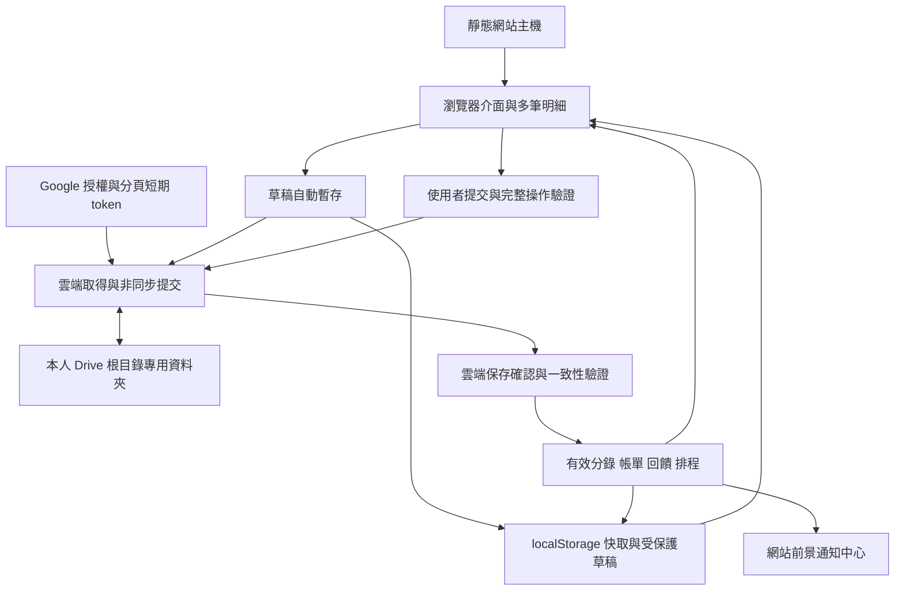

# 網頁記帳程式系統分析與需求報告

版本：v0.5 已確認需求整合（短期授權恢復更新）｜更新日期：2026 年 10 月 2 日｜適用對象：產品規劃、前端開發、測試人員。

本報告為網頁記帳程式的開發需求基準，涵蓋帳戶、六種紀錄、多筆分類明細、信用帳單、回饋、週期與分期、資料儲存及同步。系統採無後台的純前端架構，正式使用必須連接使用者自己的 Google Drive，正式帳務以本人 My Drive 根目錄下專用資料夾的有效資料為準。localStorage 用於快速載入、有限快取、偏好與受保護暫存，相關可攜資料亦非同步同步至 Drive；短期 access token 僅存記憶體與 sessionStorage，同分頁重整先向 Google 驗證身分再恢復帳本。新紀錄須經 Drive 確認保存及必要驗證後才正式入帳。

本版已整合使用者確認的 Google Drive 優先方案與本機快取非同步同步規則，取代先前可略過 Google 登入、獨立本機帳本及離線正式入帳的規格。使用者已接受的帳單、分期、退款、回饋、儲值、報帳、分類及復原規則已回寫各章；「工程建議」僅用於容量預算、效能目標與實作選擇。自動儲值及繳款只建立帳務紀錄，不實際移轉金錢。分階段交付不移除原始需求；本文與驗收案例不代表功能已開發或測試完成。

## 1 產品目標與範圍

核心目標是讓使用者管理各類帳戶、記錄日常收支與資金移動，並追蹤信用帳單、應收應付、回饋及未來應入帳項目。介面使用繁體中文，手機與桌面皆可操作；首次啟用的預設幣種為外匯 TWD。

| 範圍 | 本次規劃 |
| --- | --- |
| 使用模式 | 每位使用者獨立資料；必須連接自己的 Google Drive，同一人的資料可跨裝置 |
| 架構 | 靜態網站、瀏覽器內計算、無自建後台、無伺服器帳務資料庫或背景排程 |
| 帳戶 | 十種分組、多帳戶、帳戶各自的主幣種與進階規則 |
| 紀錄 | 支出、收入、轉帳、應收款項、應付款項、系統；每筆包含一至多筆分類明細 |
| 進階帳務 | 信用額度、帳單、折抵、回饋、儲值、國外手續費、週期、分期 |
| 資料 | Drive 正式保存、localStorage 快取優先載入、草稿及偏好非同步同步、完整匯出與復原 |
| 補充功能 | 搜尋篩選、收支統計、資產負債總覽、稽核歷程、通知中心 |
| 不在本版範圍 | 多人共用、獨立本機正式帳本、離線正式入帳、關站提醒、後台排程、銀行實際扣款、資料加密功能 |
| 後續另行定義 | 銀行明細擷取、電子發票平台串接、證券庫存成本及即時行情、自動報稅 |

保單、證券戶、加密貨幣在本版首先是帳戶分組。保單解約價值、股票持倉估值、加密鏈上轉帳及報價服務不因選擇分組而自動具備。使用者可先手動維護對應餘額；資產估值調整須另標記，避免被當作日常收入。

## 2 功能模組與需求編號

| 編號 | 模組 | 交付內容 | 章節及代表驗收 |
| --- | --- | --- | --- |
| FR01 | 本機與雲端資料 | 必要 Drive 授權、快取先載入、非同步同步、草稿復原、衝突處理、匯出及還原 | 15～16、18～19；AT01、31～43、57～63、85～89 |
| FR02 | 幣種管理 | 外匯、加密貨幣、自訂，精度、匯率及總覽換算 | 3～4；AT05～06、39、76、88 |
| FR03 | 帳戶管理 | 新增、編輯、封存、分組、縮圖與所有進階設定 | 5～9；AT02、07～08、21、54、69 |
| FR04 | 分類管理 | 預設分類與子項目、自訂、排序、封存 | 附錄 A～B；AT55、88 |
| FR05 | 紀錄管理 | 六種紀錄、主紀錄與多筆明細、新增編修、撤銷、搜尋、篩選及關聯 | 10、17～18；AT03、40、44～51、84 |
| FR06 | 資金移轉 | 同幣及跨幣轉帳、退款、手續費及折扣 | 9、10.3、12.1；AT04～05、22～23、45～46、73～77 |
| FR07 | 信用帳務 | 共用額度、結帳、到期日、折抵、繳款及提醒 | 6；AT08～14、56、64～69 |
| FR08 | 紅利回饋 | 專案、標籤、門檻、計算、上限、入帳及退款調整 | 7、10.7、12；AT15～19、27、47、78～80 |
| FR09 | 自動儲值 | 三種模式、來源帳戶、觸發門檻、固定儲值額或補到的目標餘額、儲值回饋 | 8；AT20～21、48、53、81～82 |
| FR10 | 週期與分期 | 排程、工作日、期數、利息、尾差、寬限期及回饋 | 11～13；AT24～27、39、49、52、70～75 |
| FR11 | 應收應付 | 建立債權債務、部分結清、沖銷與逾期 | 10.4；AT28～29、83、90 |
| FR12 | 通知 | 開啟網站時的低餘額、信用到期、待確認入帳、同步異常 | 6、8、13；AT14、21、30、36、82 |
| FR13 | 總覽與報表 | 各幣餘額、換算總額、收支、信用負債及未結清款項 | 3～4、10.7、18；AT03～07、28～29、44～49、83、90 |
| FR14 | 資料完整性 | 精確金額、版本、操作去重、關聯撤銷、復原及安全 | 14～17、19；AT13、18、31～43、50～51、59～63、84～89 |

## 3 共通帳務原則

### 3.1 金額與餘額

所有正式金額用十進位字串搭配十進位運算，或最小單位整數搭配精度。禁止直接用 JavaScript 二進位浮點數累加金額。顯示精度、入帳精度及計算中間精度分開；「保留小數」也要有明確位數，不能代表無限精度。

進位規則對正數金額定義：四捨五入採 HALF_UP，無條件捨去及進位分別向下及向上到指定精度。沖銷優先取原實收金額反向入帳，不把負數重新進位；新計算的負向調整先算絕對值，再套方向。

帳戶內部使用帶正負號的餘額：資產增加為正，減少為負；信用帳戶欠款為負，溢繳為正。畫面另外顯示「應付金額」「可用額度」，不要求使用者輸入負數來表達消費。一般紀錄金額輸入正數，方向由類型決定；退款使用關聯退款操作。

餘額為初始金額與已入帳分錄之和。初始金額建立專用的期初分錄，不列為收入。已有交易的帳戶變更初始金額須保留修訂歷程；改幣種應建立新帳戶並移轉，不能把既有數字直接換成另一個幣種。

正式餘額只由 Drive 已確認保存、符合入帳條件且未被衝突暫停的有效操作計算。啟動時可先顯示同一已驗證使用者的歷次雲端已確認快取，標示資料時間及核對中；這不代表新暫存紀錄可以先正式入帳。

### 3.2 收支與資金移動分開

| 動作 | 帳戶影響 | 收支報表規則 |
| --- | --- | --- |
| 一般支出／收入 | 指定帳戶減少／增加 | 計入支出／收入 |
| 轉帳／提款／存款／兌換 | 來源減少、目的增加 | 本金不計收入或支出；費用另計 |
| 信用卡消費 | 信用負債增加 | 計入一次支出 |
| 信用卡繳款 | 銀行餘額減少、信用負債減少 | 不再次列支出 |
| 借出與收回本金 | 現金與應收資產互換 | 不計收入或支出 |
| 借入與償還本金 | 現金及應付負債變動 | 不計收入或支出；利息另列 |
| 退款／消費折扣 | 資產回補或信用負債減少 | 沖減原支出，保留原類別關聯 |
| 紅利回饋 | 回饋帳戶增加或信用欠款減少 | 列回饋收入；若為原交易折讓則沖減原支出，二擇一 |
| 對帳差額 | 透過調整紀錄修正餘額 | 可依原收入／支出分類呈現，但預設日常收支分析排除並可切換 |

上述是本系統的產品帳務政策，不宣稱等同每家銀行或正式財務會計政策。投資買賣分類依原需求保留，但收入「現股賣出」不等於獲利，支出「現股買進」不等於已實現損失。MVP 報表須標為資金收支；若未來加入持倉帳，必須調整為資產交換與損益分離，避免重複計算。

### 3.3 日期與紀錄狀態

每筆資料區分交易日期時間、預定入帳日、實際入帳日、建立時間與修訂時間。報表可選交易日或入帳日，但每張報表需明示依據。帳單依入帳日歸期，回饋資格預設依交易日，亦可由專案改用入帳日。

帳本固定時區，預設 Asia/Taipei，使用者可設定。排程採帳本的曆日與時間；稽核時間保存 UTC。出國造成裝置時區改變不應讓原定每月一日的排程移日。

紀錄狀態為草稿、待提醒確認、預定入帳、已入帳、已撤銷。未入帳資料不改變實際餘額；信用分期可另有「額度保留」，與已入帳餘額分開。已入帳修正採撤銷原分錄並重建修正版；不直接改寫餘額快取。所有子紀錄必須能追溯到來源紀錄。

帳務狀態與同步狀態分開保存：雲端已保存草稿仍不是已入帳；已提交但尚未確認雲端結果的操作屬待處理，不納入正式餘額。排程計畫另有未開始、進行中、完成及終止狀態，各期保存自己的入帳狀態。

## 4 幣種管理

原始需求為外匯、加密、自訂三類，預設外匯 TWD，至少涵蓋 TWD、JPY、CNY、USD 與常見幣種。外匯資料以 ISO 4217 現行清單建立種子資料，保留歷史幣種供舊紀錄使用；ISO 4217 由 SIX 維護，不能把網路常見清單永久寫死。[SIX 幣別標準](https://www.six-group.com/en/products-services/financial-information/market-reference-data/data-standards.html)

| 類型 | 首次上架清單與行為 |
| --- | --- |
| 外匯常用 | TWD、JPY、CNY、USD、HKD、EUR、GBP、AUD、CAD、CHF、SGD、NZD、KRW、THB、VND、MYR、IDR、PHP、INR、AED、SAR、ZAR、SEK、NOK、DKK、PLN、CZK、HUF、TRY、MXN、BRL；其餘現行幣別可搜尋啟用 |
| 加密常用種子 | BTC、ETH、USDT、USDC、BNB、SOL、XRP、DOGE、ADA、LTC、BCH、DOT、AVAX、LINK、TRX；此為產品初始選擇，不代表市值排名或投資建議，可持續增修 |
| 自訂 | 紅利點數、里程、店家儲值單位等；設定名稱、代碼、符號、單位與小數位數 |

每個幣種具有不可變的 currencyId、類型、名稱、代碼、符號、入帳精度與顯示精度。加密幣可另記網路及合約識別，避免同代碼資產誤合併；自訂幣也以 ID 區分，不能只用名稱比對。

已有歷史紀錄的入帳精度不得直接改寫；每筆精確金額保存其幣種及可解讀精度。顯示格式變更不重算歷史金額。

每個帳戶只有一個主幣種。交易可選原交易幣種並保存原金額、匯率及帳戶實際入帳金額。匯率明確定義為「1 單位來源幣＝多少目的幣」，跨幣轉帳保留雙邊金額，不能只存匯率。

已確認初版採手動匯率，後續行情服務另選供應商及授權。帳本另有總覽基準幣種，預設 TWD；交易用歷史鎖定匯率，餘額估值可用指定日期匯率。缺匯率時顯示「未計入換算總額」與原幣餘額，不當作零。點數不可假設等同 TWD；需先設定換算比例。穩定幣也不可永久視為與法幣一比一。

總覽顯示各幣餘額、已換算資產、已入帳信用負債、應收、應付、淨額、匯率時間及未估值項目。未入帳信用分期本金另列；主要淨額與含未入帳分期的估計淨額分開，額度保留不可再建立第二份正式負債。應收應付預設納入；已有代表同一債權債務的帳戶時須建立映射，總覽只取一個來源。映射後不得兩邊各自任意改餘額；代表帳戶排除總額時，同一映射項目不再從內部科目加回。

## 5 帳戶管理

帳戶分組固定種子為現金、銀行、信用卡、儲值卡、禮券、紅利點數、保單、證券戶、加密貨幣、其他；每組可建立多個帳戶。全站名稱統一為「儲值卡」。分組是使用者的歸類，信用功能由「是否為信用帳戶」開關決定。

| 帳戶欄位 | 型別與預設 | 規則 |
| --- | --- | --- |
| 縮圖 | 預設圖示，可選自訂圖片 | 工程建議壓縮至 128×128、32 KB 內；正式圖片保存 Drive，本機僅暫存 |
| 帳戶名稱 | 必填文字 | 同名可提示；關聯一律以 ID 判斷 |
| 備註事項 | 選填文字 | 純文字，建議最多 2,000 字 |
| 主幣種 | 必填，外匯 TWD | 有紀錄後不得直接切換 |
| 帳戶分組 | 必填 | 從十種分組擇一 |
| 初始金額 | 十進位金額，預設 0 | 信用帳戶提供欠款／溢繳輸入方式，轉換為內部正負號 |
| 帳單週期 | 1～30 號、月初、月底 | 信用帳戶必填；其他帳戶可留空或用於對帳 |
| 是否為信用帳戶 | 預設關閉 | 開啟顯示信用設定；已有欠款時停用須先完成處理 |
| 是否為主帳戶 | 使用者選定的預設帳本 | 從現有帳戶選一個作為新增紀錄預設帳戶，同一資料集最多一個 |
| 是否有紅利回饋 | 預設關閉 | 開啟可新增多個回饋規則及專案 |
| 餘額不足提醒 | 預設關閉、門檻數值 | 單位為帳戶主幣種 |
| 自動儲值 | 預設關閉 | 開啟顯示來源、模式、門檻、金額及回饋 |
| 國外交易手續費 | 預設關閉 | 開啟顯示比率、進位與退款政策 |
| 是否納入總餘額 | 預設開啟 | 關閉僅排除該帳戶總覽加總，不刪除紀錄，不停用帳單／通知 |

帳戶可編輯名稱、分組與設定；已有紀錄的帳戶採封存，避免刪除後失去關聯。永久刪除只允許沒有紀錄、額度群組、排程及其他關聯的空帳戶。封存帳戶不可新增一般紀錄，仍須可查看與處理未結清帳務；封存前列出影響。

使用者所稱「主帳戶／預設帳本」，是從既有帳戶中選一個作為新增紀錄時預先帶入的帳戶。資料模型以 defaultAccountId 保存；Book 則表示包含所有帳戶的資料集合，避免把「預設帳本」誤作另一層帳戶容器。切換主帳戶只影響後續表單，不移轉既有交易。沒有有效主帳戶時要求選擇，不默默換成另一個帳戶。共用額度主帳戶及扣款來源仍是獨立欄位。帳戶規則只影響新紀錄，舊紀錄保留版本；開關關閉後保留歷史結果。

雲端帳戶設定與可攜偏好皆有版本；介面本機暫改不等於雲端已生效。回饋門檻、單位與上限的異動依第 7 章的計算區間政策處理，不以改版號重置上限。

## 6 信用帳戶與帳單

### 6.1 信用欄位及額度群組

| 欄位 | 原始選項與補充規則 |
| --- | --- |
| 結帳日 | 每月 1～30 號、月初、月底 |
| 繳款期限類型 | 每月固定第幾日，或結帳日後第幾日 |
| 固定繳款日 | 支援 1～31 號、月底；短月採當月月底 |
| 結帳後天數 | 正整數，至少 1 日；UI 預設 15 日，不提供 0 日到期 |
| 信用額度 | 帳戶／群組的額度；以群組額度幣種表示 |
| 共用額度帳戶 | 選擇加入既有額度群組，或建立新群組 |
| 額度主帳戶 | 群組內一個管理代表，不等於預設記帳帳戶 |
| 帳單折抵 | 開關；對應可折抵來源類型與帳單分配 |
| 自動繳款 | 開關、來源帳戶；到期日繳清全額剩餘應付，來源不足則停止 |

以 CreditLimitGroup 保存共用額度；帳戶加入群組，不建立 A 指向 B、B 又指向 C 的連鎖關係。每個群組只能一個主帳戶，同一信用帳戶只能加入一個額度群組。初版群組內限同幣種，跨幣共用額度需另有銀行換算及額度保留規則。

群組可用額度＝群組核定額度－各成員已入帳信用欠款正值合計－各成員尚未入帳的額度保留合計。信用餘額為負時取其欠款絕對值，溢繳預設不增加可用額度、不抵另一成員欠款。分期本金由保留轉為已入帳欠款時同額釋放，避免重扣。已結帳欠款是已入帳欠款的子集合，不能再加一次。可用額度低於零時顯示超額，不刪除已實際發生的消費；來源不足則不建立虛構成功的自動儲值。

例如共用額度 100,000，A 已欠 12,000，B 已欠 8,000，未入帳分期保留 20,000，可用額度為 60,000。若其中一期 2,000 入帳，欠款增為 22,000、保留降為 18,000，可用額度仍是 60,000。

已確認：共用額度由 CreditLimitGroup 處理，各帳戶帳單獨立。正附卡合併帳單以另一個 StatementGroup 表示，不因加入額度群組就自動合併帳單。StatementGroup 保存成員、結帳日、到期日、帳單代表及繳款政策；成員初版必須使用相同幣種與共同帳期。合併帳單只彙總成員分錄一次，繳款與折抵再分配回對應帳戶的未清償金額，不在代表帳戶重建一份消費。群組主帳戶變更不得搬移原交易或重算歷史帳單。

同一帳戶同時至多屬於一個有效 StatementGroup。加入、退出及共同帳期變更於下一個完整帳期生效；既有獨立帳單保留原到期日及付款政策，新群組帳期只執行群組的一套自動繳款。群組付款以一個完整操作組建立數筆各有一組來源／目的帳戶的轉帳，不突破單筆紀錄共用帳戶對的限制。

### 6.2 結帳與繳款日期

採「上期結帳日次日 00:00，至本期結帳日次日 00:00 之前」的半開區間，按實際入帳日收錄。結帳當日入帳納入本期，當日交易但隔日入帳則屬下期。保存期初、期末及實際結帳日期，不靠月份文字推算。

「月初」為一日，「月底」依當月實際天數。「每月 30 日」遇二月採當月最後一天，下一個月回到 30 日。固定繳款日取結帳後最近一個符合該日的日期；與結帳日相同時取下個月。結帳後 N 日採日曆日且 N≥1。到期日預設不套用週期的工作日調整，可依實際帳單逐期覆寫並保留原因。

例如結帳日為 10 月 20 日、固定繳款日 5 日，繳款期限為 11 月 5 日；若設定結帳後 15 日，期限為 11 月 4 日。實際帳單允許人工對帳修正並保留原因。

結帳後補登前期資料時，保留原帳單快照與付款歷程，另建立帳單調整及版本，重新計算未付並提示，不重建第二份相同帳單。

### 6.3 帳單金額與折抵

帳單保存原始消費、費用、利息、上期未付及後續調整、折抵與繳款分配。StatementItem 以 sourcePostingId 或 debtItemId 指向唯一欠款來源；新帳單顯示結轉時引用同一未清項目，不再建立負債。應付餘額＝原應付＋調整－已分配折抵－已分配繳款。來源可用金額、目標欠款未清額及帳單分配同時檢查上限；總未付對唯一欠款集合計算，不把新舊帳單展示額直接相加。提醒使用該期有效未付額。

原始需求：繳費期限前入帳的收入、回饋、折扣、退款可自動折抵最近一期帳單。已確認規則為：僅限入帳至該信用帳戶、具折抵資格且未被分配的正向帳務，分配到最近一期已結帳且未付清的帳單；同帳戶各期不得重複使用同一金額。這是一筆收入的「帳單分配」，不再額外增加帳戶餘額。

帳單折抵採最近一期已結帳且未繳清帳單，包含繳款期限當日，按帳本時區至次日 00:00 前；保留人工分配及歷程。結帳前退款先沖當期消費；結帳後至到期日的合格正向調整依規則分配。超過可分配額或期限後的正向款保留為未分配信用餘額，可在後續符合條件的帳期分配，不默默將逾期舊帳單標成已付，也不產生負應繳。正向款預設只分配本帳戶欠款；合併帳單的跨成員抵欠款須明示來源與去向，不能只搬動畫面金額。

已確認：支出表單保留「帳單折抵」入口，選取後切換為退款／折扣正向調整，要求來源及金額，並在預覽顯示信用欠款減少。一般消費不當作繳款。多筆明細切換時整筆紀錄一起切換，逐行核對原交易及可折抵金額，不能只換主紀錄標籤卻保留錯誤的支出分錄。

### 6.4 繳款與提醒

手動及自動繳款皆建立「來源帳戶 → 信用帳戶」轉帳，並分配到帳單，支援部分繳款、多次繳款及溢繳。若來源與信用帳戶不同幣別，須提供實際換匯金額；自動繳款初版限同幣種、非信用的資產來源帳戶。

已確認自動繳款於到期日、網站開啟且已連接 Drive 時執行，金額為全額剩餘應付。先取得雲端變更、折抵與既有付款，再逐張檢查來源；來源不足則停止，不改部分付款。多張帳單按到期日排序，同日以固定帳單 ID 排序，每張重新檢查餘額。合併帳單先檢查群組全額，再整組提交各成員付款，不只支付部分卻顯示全群組完成。名義到期日、帳務生效日及實際生成時間分開保存；Drive 確認後才正式入帳，關站與斷線不執行。

未分配正向款造成應付與淨欠款明顯不一致時，先列分配待處理，避免盲目再記溢繳；不把較小金額假稱全額成功。付款完成後才新增的當日退款另記正向餘額，不回寫原付款。自動來源不得是本帳戶；手動部分繳款及跨幣實收仍保留。

帳單狀態為未結帳、已結帳未付、部分繳清、已繳清、逾期。預設通知日為期限前 7 日、3 日及當日，可自訂；提醒列出帳戶、期間、期限、未付金額與明細入口。沒有銀行串接時，畫面用「已建立繳款紀錄」，不可宣稱銀行已扣款。

## 7 紅利回饋

一個帳戶可設定多項基本回饋及活動回饋。回饋規則具獨立 ID、版本及適用條件；回饋標籤是交易與規則的關聯，不以標籤文字識別。畫面分別顯示預估、已符合資格待入帳、已入帳、已撤回。

### 7.1 欄位與選項

| 欄位 | 完整選項與規格 |
| --- | --- |
| 回饋方式 | 按百分比、按照比例、固定金額 |
| 回饋計算區間 | 帳單區間、整月、指定活動區間 |
| 回饋入帳時機 | 當下交易後、依照入帳日、區間結束後、手動指定 |
| 回饋日期 | 當月／次月／次次月，1～30 號／月初／月底 |
| 回饋啟動門檻 | 最低累積消費、單筆低消門檻、消費次數門檻，可組合 |
| 單筆計算方式 | 保留小數、四捨五入、無條件捨去、無條件進位 |
| 總額計算方式 | 保留小數、四捨五入、無條件捨去、無條件進位 |
| 回饋上限 | 單筆上限、區間總額上限；未填為不限，0 為無回饋 |
| 是否為基本回饋 | 記帳選取該帳戶時自動帶入回饋標籤，可由使用者移除 |
| 回饋帳戶 | 可與消費帳戶相同或不同；須明示回饋幣種／單位 |
| 回饋專案 | 名稱、識別碼，與該帳戶規則建立關聯 |
| 活動開始與結束 | 日期時間，開始不可晚於結束；無期限須明確表示 |
| 活動詳細內容 | 自由文字，僅供說明，不直接當作可執行條件 |

規則欄位補充：適用分類、商家、國內外、指定標籤、排除項目、是否可疊加、互斥群組、優先序、門檻是否追溯全期、跨幣換算比例。另保存 eligibleEventKinds、金額基數、計次基準、固定額單位及 capGroupId，讓條件可計算，不能宣稱會自動理解使用者輸入的活動文案。

消費規則明示適用 purchase，儲值專用規則明示適用 topup；一般轉帳預設排除。規則單位與回饋帳戶幣種不同時必須提供明確換算，不把 TWD 金額直接當成相同數量點數。

### 7.2 計算規則

百分比：合格消費基數 × 百分比；例如 1,000 TWD × 2%＝20 TWD。

按照比例：明確定義為每 X 單位消費換 Y 單位回饋，X 必須大於零。已確認預設使用完整級距；可按比例小數列為選配算法。完整級距，例如每 30 元 1 點、消費 100 元得 3 點。若採可按比例小數，先得 3.333… 點，再套用回饋精度。不可只寫一個模糊的比例欄位。

固定金額分為每筆及每計算區間一次。固定每筆以原始消費識別為單位，對同一規則最多一次有效固定回饋，拆行及分期不增加次數；固定每區間以該規則的帳戶或明訂累計群組計算一次。上限與固定額使用回饋單位，跨幣須明確換算。

計算順序如下，順序與使用的條件均保存規則版本：

1. 篩選活動有效期間及適用交易，按設定的交易日或入帳日歸入區間。

2. 扣除對應退款與折扣，得到合格淨基數；消費回饋排除費用、利息、普通轉帳及回饋本身。儲值專用規則僅納入成功轉入本金，不納入失敗儲值或費用。

3. 先合計同一原始事件、同一規則與窗口的合格明細，再檢查單筆低消。只有合格事件加入累積金額及次數，多門檻全部滿足才啟動。計次使用該窗口內不同 economicEventId／purchaseId，分期各期共用原消費 ID，週期各期是新事件；全額退款不計次，部分退款按淨額重驗低消。

4. 對合格原始事件基數計算回饋，先套單筆精度與進位，再套單筆上限。每期分期模式以該窗口內符合入帳條件的期次本金為金額基數；首期模式以原消費合格本金計算一次，不含利息與費用。

5. 加總區間回饋，套用總額精度與進位，再套總額上限。

6. 以應得總額減已入帳淨額及有效待入帳額處理差額，保留計算明細。待入帳預留轉為正式入帳時不可重占上限；入帳日與規則版本改變不自動重置本期已用上限。

「達到門檻後全期都回饋」與「超過門檻部分才回饋」必須分別建模。已確認達標後追溯全期符合資格交易，但在門檻未確定時只顯示預估，不提早發放不可撤回的獎勵。

已確認基本與活動回饋可疊加；同互斥群組僅採一項，依優先序決定。區間上限預設按規則及帳戶計算，若活動跨多帳戶共用上限，必須顯式指定共同累計群組。

互斥規則優先序相同時以固定規則 ID 排序；跨帳戶上限依已驗證雲端事件、固定日期及來源 ID 順序計算，不由檔案下載先後決定。

### 7.3 入帳日與規則異動

「當下交易後」指原交易已正式入帳且資格已成立才建立回饋；不因儲存草稿就增加餘額。「依照入帳日」以原交易入帳月份為錨點，再套當月／次月／次次月與指定日；「區間結束後」以區間結束月份為錨點；「手動指定」直接選日期。當下交易後不顯示不適用的回饋日期欄位。

若算出的日期早於資格成立日，不回填成過去已入帳，而在最早可執行日生成待入帳項目並標示原因。累積門檻、區間總額進位或上限會影響最終結果時，當下回饋只能為暫估或暫發，區間結束必須做差額調整。短月依月底回退規則。

退款回到原活動及原計算窗口重驗資格，使用原規則與差額分錄調整，已入帳回饋不直接刪除。例如原累積 3,000 才領 60，退款後剩 2,900，依門檻可能追回整期 60；預覽需列出受影響其他交易。已花掉的點數預設可形成負點數並提醒，不丟棄差額。無原單不猜測原回饋；明確不追回時保存人工調整原因。修改門檻、單位與上限預設從下一計算區間生效，改本期須先預覽並明示重算；不靠改名稱或版號另領一份固定回饋。

## 8 低餘額提醒與自動儲值

### 8.1 低餘額提醒

原始條件為帳戶餘額低於指定值時通知。使用已入帳餘額，於從大於等於門檻變成小於門檻時提醒一次；持續低於時不每次開頁重複跳窗。回升後再次跌破才重新觸發，通知中心持續保留未處理狀態。

提示在整筆消費及成功儲值處理後判斷，正常補足不再跳瞬間低餘額警告；儲值失敗另通知。已讀與已處理分開，未解決事項仍保留。

信用帳戶將同一設定文案改為「可用額度不足提醒」，門檻比較可用額度；原始帳戶餘額提醒仍可於一般帳戶使用。提醒門檻與自動儲值門檻互相獨立。

### 8.2 自動儲值設定與算法

| 欄位 | 規格 |
| --- | --- |
| 儲值方式 | 消費後儲值、補足差額、消費前儲值 |
| 餘額低於 | 觸發門檻 T，帳戶主幣種；餘額等於門檻時不觸發 |
| 儲值來源 | 其他有效帳戶，禁止選自身 |
| 固定儲值金額 | 固定 A＞0，僅消費前／後儲值模式使用 |
| 補到的目標餘額 | 目標 G，僅補足差額模式使用；與觸發門檻 T 分開設定 |
| 儲值回饋 | 關聯紅利規則；未設定顯示「無」 |

設 B 為消費前餘額，C 為該次消費對此帳戶的實際扣款總額，T 為觸發門檻，A 為固定儲值額，G 為補足後的目標餘額。已確認「消費前儲值」以預測消費後餘額判斷；「補足差額」低於 T 才補到 G。驗證 T≥0、G≥T，兩者以帳戶主幣種表示。

| 模式 | 觸發與金額 | B＝300、C＝250、T＝100、A＝500、G＝600 |
| --- | --- | --- |
| 消費後儲值 | 先記消費；B−C＜T 時轉入一次固定 A | 消費後 50，轉入 500，最終 550 |
| 消費前儲值 | 預測 B−C＜T 時先轉入 A，再記消費 | 先轉入 500，消費後最終 550 |
| 補足差額 | B−C＜T 時轉入 G−(B−C)；否則為 0 | 消費後 50，補入 550，最終 600 |

目標餘額 G 不是每次固定轉入金額，也不是觸發門檻 T。例：T＝100、G＝600，消費後餘額 150 不儲值；餘額 100 也不儲值；餘額 50 才轉入 550。單一紀錄有多筆明細時，先合計全部明細、折扣及同次扣款費用，再判斷一次；明細的排序與拆分不影響觸發結果。

固定金額每次主紀錄最多觸發一次，若仍低於門檻則顯示不足，不無限自動重試。儲值為一筆來源與目的配對的轉帳，本金不列收入。儲值回饋由獨立回饋規則建立；若儲值來源是信用帳戶，增加信用欠款及額度占用，但儲值本金仍不列日常支出。

初版自動儲值限同幣種，目的為非信用的資產或儲值帳戶，來源可為另一資產或信用帳戶。信用來源檢查可用額度，信用帳戶付款使用信用繳款流程。來源不足時不建立成功轉帳，標示待處理；已實際發生的消費可經使用者明確選擇保留，包括必要的負餘額，仍須連接 Drive 並完成正式提交。不得因儲值失敗遺失真實消費。

拒絕 A 從 B、B 又從 A 儲值等循環。自動轉帳與回饋不再啟動下一層儲值；整筆明確消費只判斷一次。儲值回饋以成功轉入本金為基數，只套用 topup 規則。刪改來源先顯示影響：已實際儲值預設保留並可解除自動管理，未發生預估項可撤銷；生成識別保留已接管／已抑制狀態，防止重算再生。

## 9 國外交易手續費

| 欄位 | 規格 |
| --- | --- |
| 手續費％數 | 非負十進位百分比，可為 0 |
| 計算方式 | 保留小數、四捨五入、無條件捨去、無條件進位 |
| 退款時是否退回手續費 | 布林值，保留原設定快照 |

交易另有「國外交易」標記及可修改的費用金額。外幣不一定代表境外交易，境外也可能以 TWD 計價，因此不能只以幣別差異判斷。預估費用＝整筆主紀錄於帳戶主幣種的合格消費本金合計 × 費率，再按主幣種及費用進位規則入帳。可人工覆寫為銀行實際費用，並記錄原因。

費用產生一筆關聯的系統「手續費」，主交易保存淨本金，報表支出為本金加費用，不能主交易已含費又重複加計。費用預設不再產生手續費或回饋。

分期預設首期收取一次費用，不在每期重新按原總本金收費；實際逐期收費時須保存對應設定及期次。

全額退款且允許退費時退回原實收費用；部分退款按原費用比例分配，最後一次退款吸收尾差，累計退費不超過原費用。若銀行退費不按比例，允許實際金額覆寫。外幣退款可使用不同實際匯率，不強制重用原付款匯率；退費仍以原費用幣種與實收額控制。

外幣退款以原幣淨本金限制可退本金，帳戶實收額獨立保存；原成本回沖與實收的差額另列匯兌調整。原扣 3,200 TWD、全額退款實收 3,500 時，原成本回沖 3,200、匯差 +300，不以 3,200 拒絕合法實收。

## 10 六種紀錄與共用表單

### 10.1 共用欄位

每筆紀錄由主紀錄及一至多筆子項目明細組成，子項目各有分類、名稱、金額及選填備註；帳戶、幣種及日期時間由主紀錄共用。原始商家、發票號碼、隨機碼、備註及進階設定保留於主紀錄。收入、應收、應付、系統可共用相同骨架，僅顯示合理欄位；例如收入商家可改為付款方，應收應付增加往來對象。

| 欄位 | 必填及驗證 |
| --- | --- |
| 類型及子項目 | 主紀錄選一種紀錄類型；每筆明細選該類型的分類最底層項目 |
| 金額及幣種 | 每筆明細輸入正數金額，主紀錄共用幣種並自動加總；全額折讓後的零淨額須有對應原因 |
| 名稱 | 各明細必填，可用分類名稱預填；主紀錄另有選填摘要名稱 |
| 帳戶 | 整筆共用，預設帶入主帳戶；轉帳共用一組轉出／轉入帳戶 |
| 商家／往來對象 | 一般交易選填；應收應付必填，便於結清 |
| 日期及時間 | 全部明細共用，預設當下；允許補記，未來日期轉預定入帳 |
| 發票號碼及隨機碼 | 選填，存字串保留前導零；台灣格式可提示，不阻擋其他地區格式 |
| 備註 | 選填純文字 |
| 進階設定 | 入帳方式、週期或分期；依交易類型控制可用性 |
| 補充欄位 | 回饋標籤、原交易幣種、入帳日、國外交易、關聯原單、附件擴充欄位 |

同發票號碼或同帳戶同日同額可提示可能重複，但不強制拒絕。切換帳戶後重新檢查幣種、回饋、信用設定；金額不暗中換匯。儲存前提供所有自動衍生項目的預覽。

### 10.2 入帳方式

| 選項 | 已確認行為 |
| --- | --- |
| 立即入帳 | 單筆提交經 Drive 確認後正式入帳；週期／分期到期且連線完成後執行 |
| 提醒入帳 | 到指定日期進入待確認，使用者確認、連線提交且 Drive 確認後才影響餘額 |
| 延後入帳 | 保存實際發生日與未來入帳日，到期且連線完成 Drive 確認後自動正式入帳 |
| 帳單折抵 | 僅信用相關的退款／折扣／收入等正向調整適用；建立帳單分配 |

週期與分期的入帳方式只包含前三種，帳單折抵是帳務用途，不作為排程模式。須設定延後日期，不能只有「延後」標籤。關閉網頁期間的自動事項採下次開啟補執行，保留應發生日與實際生成時間，詳見通知章節。

帳單折抵用途與入帳排程分欄保存。表單可先快取及非同步同步為雲端草稿；使用者未提交、雲端未確認或入帳條件未成立時，都不影響正式餘額。

### 10.3 轉帳與退款

原始子項目為轉帳、提款、存款、退款、兌換。欄位包含來源帳戶、目的帳戶、轉出金額、轉入金額、匯率、手續費及折扣，並保留日期時間、名稱及備註。兩帳戶不可相同。

同幣轉帳預設本金相等；跨幣由來源本金與匯率算目的金額，或由兩邊實收金額反算匯率。若同時輸入三項而不一致，必須提示並指定以哪兩項為準。手續費另設定金額、幣種、扣款帳戶；折扣明示是手續費折扣或其他折讓，不能把兩種語意合併。

例：來源轉出本金 1,000 TWD、手續費 15 TWD、手續費折扣 5 TWD，來源實扣 1,010 TWD，目的收到 1,000 TWD，費用淨額 10 TWD。跨幣例：來源本金 3,200 TWD、1 TWD＝0.03125 USD，目的 100 USD，若另付 30 TWD 費用，來源實扣為 3,230 TWD。

「退款」入口需區分兩種情況：商家退回先前消費，選原交易及收款帳戶，屬外部退款，不強迫選一個虛構的自有來源帳戶；自有帳戶間把款項轉回，則建立反向轉帳。無原單退款允許手動建立但要求說明其報表歸類。部分退款累計不得超過原本金，特殊超額補償應另列收入。

有原單與無原單是明確資料變體，後者不要求偽造 lineId，不自動退原費用或追回回饋。跨幣退款保存原幣退本、原成本回沖、實收帳戶／幣種／金額、匯差及退費；退款上限按原幣逐行檢查。分期退款的未來本金取消不得與同額實際收款重複，詳見第 12 章。

### 10.4 應收與應付

應收預設項目為借出、代付、報帳；應付為借入、信貸、車貸、房貸。分類預設一層，可新增同層項目，並依原需求保留自訂子分類。每筆紀錄可包含多筆該類型的明細，共用資金帳戶、幣種、日期與往來對象；每行分別建立可追蹤的債權債務及未結清額。往來對象、原始本金、已結清、未結清、到期日及關聯付款／收款仍須保存。

借出 1,000：付款帳戶 −1,000、應收資產 +1,000；收回 400：收款帳戶 +400、應收資產 −400，剩餘應收 600。借入則增加現金及應付負債，還本金時兩者同額下降。利息收入與支出另生系統紀錄，不混在本金。

替他人代付直接建立應收，不另列自己的支出。自己的支出後報帳，申請中保留支出且不建立第二次現金流；核准部分以非現金調整轉為應收並沖減原支出，收到款項時只結清應收。例：支出 1,000、核准 600，核准後支出 400、應收 600，收到 600 後應收結清。真正獨立補助使用收入用途。報帳拒絕、呆帳及債務減免採明確調整結清並保留原因。

支援一筆債權多次收款、一筆還款分配多筆債務、部分結清及逾期。結清操作建立收付款分錄與分配，不要求使用者另新增一般收入／支出來完成。這些往來項目若已有代表它們的帳戶，總覽不得再加一次虛擬應收／應付。

應收分期收回與應付分期還款必須指向既有 Obligation；初始借出／借入、分批撥款及後續結清是不同 purpose／scheduleAction，不能每期再建立一次原本金。

### 10.5 系統紀錄

原始子項目為手續費、折扣、紅利回饋、利息支出、利息收入，分類預設一層，允許自訂項目及子分類；每筆紀錄可有多個明細。系統紀錄可由規則生成，也可手動新增。手續費及利息支出預設為支出，利息收入及一般回饋預設為收入；折扣優先沖減關聯費用或消費。自訂項目必須指定方向與報表用途。

衍生紀錄保存來源、規則版本及生成識別。以 DerivationLink 區分 managed、detached、suppressed；改為手動後保留歷史來源與接管狀態，同一生成識別不再自動建立另一筆。修改已入帳來源先預覽費用、回饋、折抵、儲值及額度影響，原分錄沖銷後建立修正版。實際退款是後續事件，不等同刪除原消費；轉帳兩端始終一起處理。

### 10.6 一筆紀錄包含多筆子項目明細

已確認：所有六種類型的每筆紀錄均可包含一至多筆明細，全部共用帳戶、幣種、交易日期與時間；每行有自己的分類、名稱及金額。例如一次超商付款，同時包含「飲食／飲料 60 元」及「家居／日常用品 140 元」，整筆合計 200 元，帳戶只扣 200 元。單行模式是相同模型的簡化介面，不另做一套資料格式。

「分類子項目」指分類樹的選項，例如早餐；「紀錄子明細」指本次交易的一行，例如早餐三明治 60 元。增加明細不增加分類樹深度，也不代表產生另一筆獨立消費。

| 層級 | 保存內容 |
| --- | --- |
| 主紀錄 Transaction | 類型、共用帳戶／轉帳帳戶對、幣種、日期時間、入帳日、狀態、摘要、商家、發票、隨機碼、整筆備註、週期／分期設定 |
| 子明細 TransactionLine | lineId、transactionId、分類、名稱、金額、行序、備註、回饋適用標籤、退款或結清來源關聯 |
| 金額分配 Allocation | 整筆折扣、費用、回饋、分期或退款對各明細的分配，以及所用版本 |

主紀錄總額為明細加總及費用／折扣調整的結果，不能與明細總和各自任意修改。輸入總額後若明細未分完，顯示剩餘差額並阻止正式入帳，可保留草稿。每行具有穩定 ID，增刪、複製及排序不可用畫面陣列索引作為永久引用；複製會產生新 lineId。

整筆共用商家、發票、入帳方式及週期／分期設定，明細可有自己的名稱、分類、備註及回饋適用性。不同帳戶、日期、幣種或商家應另開紀錄；單一明細不得覆寫已確認共用的帳戶、幣種與日期。此限制不妨礙跨幣轉帳在主紀錄共用一組來源／目的幣種。一般外幣交易共用原交易幣種及帳戶入帳幣種；先確認整筆實際入帳額，再分配至各行並處理最小單位尾差，兩種幣別各自加總。

### 10.7 多筆明細的加總與連動

支出本金為各明細淨額之和，實際扣款再加關聯費用；收入淨入帳為收入明細總額減相關費用。主紀錄只是容器及摘要，不再產生一套與明細相同的金額分錄。報表按明細分類加總，帳戶金流按同一完整操作組計算，避免「主紀錄 200＋明細 200」被算成 400。

整筆折扣若無指定歸屬，預設按各行折扣前合格金額比例分攤到主幣種最小單位；先分配整數單位，再把尾差依小數餘數由大到小分配，同餘數以固定 lineId 排序。單行分攤不得超過其可折讓金額，整筆折扣不得超過可折讓總額。允許手動分配，但總分配必須精確等於折扣。主紀錄及各行只保存一次實際折扣效果；費用分配也只是費用的分析歸屬，不是再次扣款。

| 類型 | 多筆明細規則 |
| --- | --- |
| 支出／收入 | 同一類型各行分類可不同，正數輸入；總額自動加總。例：飲料 60＋日用品 140＝200 |
| 轉帳／兌換 | 共用同一組轉出與轉入帳戶，各行可有雙邊金額及匯率；先各行換算與進位，再分別加總來源及目的幣金額，不能混幣相加 |
| 退款 | 共用收款帳戶及日期；有原單各行選原 lineId 及原幣退本，無原單填原因及分類；退款與一般資金轉帳不混在同一張主紀錄 |
| 應收／應付 | 共用資金帳戶、幣種、日期及往來對象，每行保留各自本金、到期日、未結清額及分配；不能把不同現金流方向混在同張紀錄 |
| 系統 | 可有多個同帳戶同日項目，各行依費用、折扣、回饋等用途保存方向；畫面分列流入、流出及淨額，不把正負混合後的淨額當成分類收支 |

回饋先依各行分類與標籤篩選，再對同一原始消費、同一規則及同一計算窗口的合格淨消費加總；在這個層級計算「單筆」門檻、完整級距、進位及上限。消費次數按同窗口內的原始 economicEventId／purchaseId 計一次，不因拆成十行而算十次。基本回饋由本筆所選帳戶設定帶入，各行可排除不適用項目。例：60 元＋40 元均符合相同 1.8% 規則、單筆捨去至元，應先算 100×1.8% 得 1 元，不能分行各捨去成 0 元。若只飲食合格，日用品不加入該規則的基數。

國外交易手續費預設依整筆合格本金算一次；明細分攤用於分類查詢。自動儲值依整筆對儲值帳戶的實際扣款判斷一次。回饋、費用及儲值的自動產生紀錄具有來源關聯，與使用者輸入的分類明細分開標記，不能因畫面展開而重複入帳。

有原單的部分退款以原 lineId 的「原幣淨本金－累計已退原幣本金」為上限，與帳戶幣實收額分離。全退沖回各行剩餘原成本，匯差、退費及回饋差額另有來源分配。無原單模式填理由及報表用途，不偽造引用。刪改已被退款、結清或分期引用的行，先預覽相依影響，不留下失效引用。

週期模板包含完整明細，生成各期時保留模板行來源，每期有新的實體 ID。分期先計算整筆各期本金與利息，再分配各行的期次金額，形成「明細×期次」分配表：每行跨期合計等於該行本金，每期所有明細本金合計等於該期本金；利息獨立分配，不能和本金互相挪用尾差。例：700 元及 300 元分 3 期，整筆本金 333／333／334，可分為 233／233／234 及 100／100／100。不可各行獨立進位後造成當期總額超過計畫。

一次完整操作涵蓋主紀錄、全部明細及當次相關分錄／分配；本機暫存成功後非同步上傳，Drive 確認及驗證後才正式生效。撤銷依影響計畫保留或沖銷衍生紀錄，不強制刪除已解除自動管理或實際發生的資金移動。不同明細並發修改仍按整筆版本處理，同時驗證跨紀錄的退款、帳單及回饋上限。舊版單分類遷移保留原 transactionId、來源及既有分錄，不重複金流。

### 10.8 進階功能的帳務用途

| 用途 | 週期或分期的效果 |
| --- | --- |
| 消費 | 週期每期新事件；分期為同筆本金與利息分配，原購買摘要不再過帳 |
| 收入 | 週期每期新收入；分期分次入帳，利息方向為收入 |
| 應收建立／結清 | 新借出與分期收回分開；結清減少既有債權 |
| 應付建立／結清 | 新借入與分期還款分開；本金減債，利息列支出 |
| 手動系統項目 | 依費用、回饋、利息或折扣用途保存方向；可排程或分攤，但不無限巢狀生息 |
| 規則自動系統項目 | 使用來源排程及分配，不再附加另一套自動排程 |
| 一般轉帳與退款 | 保留原雙邊與退款流程；不因共用表單自動開啟未定義的消費分期 |

多帳戶結清以一個操作提交數筆各自合法的紀錄；每筆仍維持共用帳戶或帳戶對。欄位的顯示、必填、切換及群組繼承條件由 purpose 控制，隱藏設定不繼續偷偷生效。

## 11 週期紀錄

| 欄位 | 原始需求與補充規則 |
| --- | --- |
| 區間 | 每 N 日、N 週、N 月、N 年，N 為正整數 |
| 指定日期 | 依區間選星期幾、每月幾號；每年補充月份及日期 |
| 起始期數 | 正整數，標示目前從第幾期開始 |
| 次數 | 有限總期數或無限期 |
| 入帳方式 | 立即入帳、提醒入帳、延後入帳 |
| 遇非工作日 | 依原日期、延後至下個工作日、提前至前個工作日 |

補充必填為開始日期、帳本時區；可選結束日期。起始期數與總期數分開：從第 3 期開始、共 12 期，僅生成第 3～12 期，共 10 筆；歷史第 1～2 期不自動補造。無限期只在有限展望窗口產生預覽，不能一次產生無限筆。

以最初的曆日規則逐期推算，不能從前次假日調整後日期接續計算。月 30 日遇短月落月底，之後恢復 30 日；每年 2 月 29 日遇非閏年用 2 月 28 日，並可顯示此政策。

已確認工作日初版採週末加自訂假日：預設週一至週五為工作日，使用者可標記休假或補班。官方假日日曆及行情服務另行選擇，不作為本版必要依賴。排程保存日曆版本；結帳日及回饋日不自動沿用週期入帳的工作日調整。

「延後入帳」在週期中需補充與每期應發生日的相對天數或可解析日期規則，不接受一個所有期數共用的過去日期。「立即入帳」代表該期到期且完成 Drive 確認時自動正式入帳，不代表今天把未來各期全記入餘額。

編輯時提供只改本期、本期與以後、整個系列；已入帳項目不得靜默重寫。可暫停、恢復、略過單期及終止。長期未開啟時，逐批補齊到今天；保留原應發生日並去重。補執行會產生大量或需要來源餘額的項目時先顯示清單，讓使用者處理衝突。

斷線只保留草稿及預覽，連回 Drive 並核對相依資料後才補執行；尚未按提交的草稿不因恢復網路而自動正式入帳。

## 12 分期紀錄

週期是同一筆模式反覆發生，分期是同一總金額的攤分。同一交易模板兩者互斥；若需要每月新消費又分期，應另建「週期產生分期計畫」，列後續擴充，不能在第一版不加限制地互相巢狀。

| 欄位 | 原始需求與細化規則 |
| --- | --- |
| 區間 | 每 N 日／週／月／年，另記首期日期 |
| 起始期數 | 依原本利表標記前期已處理，分別驗證剩餘本金及利息 |
| 分期期數 | 正整數，至少 2；總期數不得小於起始期數 |
| 利息類型 | 無息／有息；有息輸入本金與總利息，分攤至各期 |
| 分期計算方式 | 四捨五入、無條件進位、無條件捨去 |
| 每期金額 | 由本金及總利息分攤，顯示每期本金、利息及本利合計 |
| 分期餘額納入 | 已確認為尾差放首期或末期；本金、利息各自守恆 |
| 首期金額 | 可覆寫；需檢查後續分配是否仍可成立 |
| 入帳方式 | 立即入帳、提醒入帳、延後入帳 |
| 遇非工作日 | 依原日期、延後、提前 |
| 寬限期 | 無、一個月、兩個月 |
| 回饋納入 | 每期或首期 |

本金 P、期數 n，均分本金先以指定進位求 q，再算尾差 r＝P−q×n；尾差可能為正或負，按設定加到首期或末期。例：1,000 元分 3 期、以元為精度且無條件捨去，q＝333、r＝1，末期吸收即 333、333、334；無條件進位為 334、334、332。每期本金總和必須精確等於原本金，任何一期不得因此變負。

首期本金與利息分欄，可明確鎖定；扣除首期後分配其餘金額。若固定首期與尾差首期無法同時滿足，阻止提交並要求改相容設定，不自動把尾差挪到末期。保存實際本利表與尾差位置；零元或負數期次須明示檢查。

已確認有息分期採「輸入本金 P、總利息 I、期數 n」；無息為 I＝0，有息的每期應付由本金加利息組成。本金及利息各自按相同的期數、精度與指定進位分攤，各自尾差放指定首期或末期，確保 Σ本金＝P、Σ利息＝I、Σ應付＝P＋I。例：本金 1,000、總利息 30、3 期、捨去至元、尾差末期，本金為 333／333／334，利息為 10／10／10，每期本利為 343／343／344，總應付 1,030。總利息由使用者依實際合約輸入，不由系統推測利率，也不使用本息平均攤還的利率公式代替這項已確認模式。

寬限期為無、一個月、兩個月；已確認首期錨點及後續期次一起順延，保留原名義日與短月回退規則，總期數、本金及輸入總利息不變。實際利息增加或減免由使用者輸入後預覽，不自動增加利息。從中途接手時沿用原本利表及前期已處理狀態；例如本金 12,000、利息 120、12 期，已處理 2 期後剩本金 10,000、利息 100，只生成第 3～12 期，不重占已付本金額度。重新安排剩餘款項則另立明確修訂計畫。

新信用消費分期全額本金先占用額度；中途接手只保留尚未入帳本金，各期入帳時等額釋放保留並轉成欠款。一般信用消費的支出分析先採每期入帳本金及利息計列；另提供原始購買總額欄位，不能同時把總額與每期本金都算支出。貸款分期償還的本金不列支出，只有利息列支出。

每期回饋以該窗口內已符合入帳條件的期次合格本金為基數，同一原消費合併判斷單筆條件；首期回饋以原合格本金計算一次。固定每筆對同一原消費與規則最多一次有效回饋，計次不因分期增加。利息及費用不列回饋基數，明細×期次依第 10.7 節分配。

### 12.1 分期退款與取消未來本金

不能假定退款一定取消未來分期。提供三種明確操作，預覽對帳戶、帳單、剩餘本金、利息與額度的影響。

| 方式 | 本次現金或信用帳戶效果 | 未來分期效果 |
| --- | --- | --- |
| 已退回款項，分期照常 | 依實際退款增加帳戶餘額或減少信用欠款 | 原排程與保留額維持；避免同時取消本金而重複受益 |
| 取消未入帳本金 | 該部分不再建立一次已收到的退款金流 | 減少未來本金與對應額度保留；依取消分配更新期次 |
| 混合處理 | 只對實際已退回部分入帳 | 其餘明確分配至取消的未來本金；兩部分合計等於本次退本 |

例：原本金 12,000，已入帳 2,000、未入帳 10,000，退款 3,000。若已收到 3,000 而原分期維持，未來本金仍是 10,000。若實際取消未來本金 3,000，未來本金改為 7,000，但這部分不再加一筆收款 3,000。若兩者都做，便會重複抵減。

取消未來本金而未指定期次時，預設從最後一期往前取消，保留近期已知繳款安排；允許按實際新分期表重新分攤。未入帳利息是否減免由使用者依實際情況輸入，不自動假設按比例退息。已入帳利息與手續費只有實際退回時才沖回。

退款本金同時受到原交易與各明細剩餘可退額限制。外幣以原幣淨本金檢查上限，實收帳戶幣金額獨立保存；例如原扣 3,200 TWD、退回實收 3,500，原成本回沖 3,200，匯差 +300 另列。沒有原單的退款可手動分類並填原因，但不猜測原回饋或原費用。

### 12.2 提前清償

提前清償與商家退款分開操作。信用消費分期先把選定未入帳本金轉成待清償欠款，同額釋放保留，再建立付款；貸款已有完整債務時只結清剩餘本金，不再建立一次債務。使用者輸入實際應付利息、減免與手續費，系統提供總額預覽。

完成後原未來期次標記已被提前清償取代，後續重開或同步不得再生成。來源不足則不自動改部分清償，保留為待處理。

## 13 通知與自動執行邊界

| 事件 | 觸發與呈現 |
| --- | --- |
| 帳單到期 | 到期前指定天數、當日及逾期；顯示未付金額與明細 |
| 低餘額／低額度 | 跌破門檻時一次，回升後重置 |
| 提醒入帳 | 排程到期時建立待確認項目 |
| 自動事項失敗 | 來源不足、匯率缺失、關聯帳戶封存、規則衝突 |
| 同步或備份異常 | 授權失效、儲存空間不足、資料衝突、還原需求 |

已確認網站關閉後不需要提醒。通知僅在網站開啟時透過通知中心與站內提示呈現；背景分頁或休眠後於重新取得前景時檢查到期事項。關閉期間不建立推播訂閱、不執行雲端背景排程，也不要求作業系統通知權限。

網站前景以輕量計時器、載入、恢復前景、同步完成及使用者操作觸發到期檢查；背景暫停主動輪詢，恢復前景補讀。正式自動帳務只在已連接 Drive、相依資料完整且無未解衝突時執行，不依賴關站或 Service Worker 背景定時能力。[MDN 週期背景同步](https://developer.mozilla.org/en-US/docs/Web/API/Web_Periodic_Background_Synchronization_API)

重新開啟時，在辨識並驗證同一使用者後先讀版本相容的 localStorage 快取，顯示快取時間及同步中，背景取得雲端變更；未授權時不顯示另一位使用者帳務。雲端核對完成後再處理到期帳單、週期、分期、回饋與繳款。斷線只可看已載入資料及編輯草稿，停止正式入帳與自動帳務。

補執行保留名義日期、實際處理時間及規則版本。固定金額排程可依歷史應發日補記；自動繳款則重新檢查實際未付額，先扣除使用者已記的繳款及折抵，避免事後補記兩次。長期未開啟時以一份待處理摘要呈現，不逐筆跳窗。所有自動儲值及繳款都只建立帳務紀錄，不代表金錢已實際移轉。

補處理依名義日期及依賴排序：已知交易和到期分錄 → 帳期截止與結帳 → 依該區間的回饋結算 → 已到入帳日的正向款分配 → 到期繳款 → 通知。回饋不回頭變成可領回饋的消費。金額改變、來源不足、缺匯率或歷史修訂影響者轉待處理；固定無衝突的已授權排程可補執行。

## 14 系統架構

已確認採無後台的純前端單頁應用，由靜態網站主機提供 HTML、CSS 與 JavaScript；瀏覽器直接授權及呼叫 Google Drive API，計算、同步合併與通知均在裝置上完成。沒有自建 API 後台、服務帳戶、伺服器資料庫或排程服務。核心計算使用可獨立測試的 TypeScript 模組；UI 框架可在開發時依團隊選擇。帳務核心透過統一提交介面連接 Drive 與本機暫存，不讓畫面直接改寫正式餘額。PWA 離線頁面快取可列第二階段；只有把資料放 localStorage，並不保證未曾載入或頁面資源未快取時也能離線開站。



分層建議：展示層處理表單與互動；應用層執行新增交易、繳款、還原等完整操作；領域層處理金額、分錄、帳單、回饋及排程；儲存層負責本機和雲端；查詢層建立餘額、分類及日期索引。

前端使用案例函式至少包含 createTransaction、reviseTransaction、reverseTransaction、settleObligation、generateScheduleOccurrences、closeStatement、calculateRewards、applyRepayment、syncBook、exportBook、restoreBook。每個會產生帳務的操作傳入唯一 operationId，返回主紀錄、衍生分錄及待處理問題；相同 ID 重送不得生成第二份。

另包含 saveDraft、syncDraft、resumeSubmission、verifyCloudCommit、rebuildCache。草稿同步與正式提交採不同資料角色及狀態，不能共用一個「已儲存」旗標。

## 15 localStorage 快取、草稿與復原

localStorage 的用途是加快載入及保護尚未完成的工作，完整正式帳本保存於 Google Drive。localStorage 仍是同步字串 API，瀏覽器仍可能限制容量或禁止存取；不因改採雲端就忽略寫入失敗。[MDN Web Storage](https://developer.mozilla.org/en-US/docs/Web/API/Web_Storage_API)、[MDN 儲存配額](https://developer.mozilla.org/en-US/docs/Web/API/Storage_API/Storage_quotas_and_eviction_criteria)

| 本機資料角色 | 與 Google Drive 的關係 | 清理原則 |
| --- | --- | --- |
| 已驗證摘要及最近查詢快取 | 對應雲端快照／操作版本；由雲端重建，不將舊摘要上傳覆蓋正式帳務 | 可丟棄，工程預算暫定約 1 MiB |
| 可攜偏好與設定 | 版本化、非同步保存到 preferences；影響計算的帳戶／規則設定另走正式操作 | 確認相同版本已在雲端後可移除本機副本 |
| 編輯草稿 | 自動非同步保存至 drafts；包含全部明細、所有者、版本及基礎交易版本 | 最新未確認版本受保護；雲端已保存仍不算入帳 |
| 已提交但結果待確認的操作 | 保存完整操作組、operationId、batchId、依賴版本與重試識別 | 查明雲端結果並可復原後才清除，不能當一般快取淘汰 |
| 裝置狀態與連線提示 | folderId／bookId 可作重新查找提示；游標、鎖及工作階段屬本裝置 | 不把另一裝置的游標、鎖或授權狀態直接套用 |
| access token | 僅存記憶體與 sessionStorage，不寫入 localStorage、Drive、匯出、日誌或 GitHub | 保留 Google 原到期時間；到期、401、帳號不符、登出或切帳號即清除；關閉分頁通常清除，但瀏覽器恢復行為不可作安全保證 |

「本機內容非同步同步」指可攜資料及完整操作的同步，不是原樣上傳所有 localStorage key。Drive 的 draft、preferences、operation 有明確角色；快取內同一交易不再當成一筆新增交易。

所有資料以 Google 穩定使用者識別、bookId、schemaVersion 隔離；裝置狀態再帶 deviceId。單一草稿／待提交操作保存完整 JSON，不能把跨多個 key 的成功當成原子交易。草稿有 draftId、revision、baseRevision／baseEntityVersion 及 submittedOperationId，正式結果確認後標成已提交或建立 tombstone，避免另一裝置再提交同份草稿。兩裝置編輯同一草稿保留衝突版本，可另存副本；偏好衝突可逐項選擇，不默默改動帳務設定。

同份草稿正式提交使用共同的穩定提交識別；同一草稿不同修訂並發提交視為同一建立意圖的衝突，不能因裝置各產生新 ID 就變成兩筆消費。確認入帳後的再編輯是修訂既有紀錄；只有明確「複製為新紀錄」才建立新 draftId 及新消費識別。

可丟棄快取暫定序列化後約 1 MiB，需在目標瀏覽器校準；草稿與未確認操作另行保護，不永久快取全部歷史帳本。遇 QuotaExceededError、storage 不可用、JSON 損壞或未知格式時，先清可重建快取，仍失敗則保留表單、明示尚未安全暫存並提供下載。未建立可靠待提交識別前不送出正式操作；不得把寫入失敗顯示成成功。Drive 已驗證保存的草稿副本可清理，但有更新未上傳的本機版本不能清掉。

本機多分頁以可用互斥能力協調單一寫入者及同步佇列，再通知其他分頁刷新；無法可靠協調時提供唯讀次分頁與取得編輯權流程。storage 事件只能通知，不能當原子鎖。去抖草稿寫入與批次上傳降低阻塞；不依賴關站瞬間的網路請求成功。

完整匯出採包含 JSON 與縮圖內容的打包檔，或小型資源內嵌格式，內容依第 16.5 節。草稿及未確認提交另標狀態，匯入不得直接變成已入帳；不匯出 token 或可套到別的裝置的同步游標。CSV 每列為一筆子明細，附主紀錄／明細 ID、幣種、用途及分配金額，主紀錄總額只作摘要；CSV 供分析，不宣稱能完整還原。匯入先驗證 schema、所有者導入流程、引用、金額及資源，再顯示預覽。

每份帳本保存 schemaVersion 與 minWritableAppVersion。舊分頁遇到未知或不相容版本進入唯讀並提示更新，不能丟棄未知欄位再存回。遷移先建立新快照、驗證及保留復原點，再切換版本；不逐筆覆寫唯一有效資料。checksum 用於偵測損壞，不等同加密或安全簽章。

清除一般快取不刪除雲端帳本及受保護草稿。瀏覽器清除網站資料、無痕或換裝置仍可能使尚未上傳的草稿消失，介面必須顯示其保存狀態。重新登入從 Drive 快照與操作重建，游標必須與相符資料版本共同使用，不能清掉資料卻只讀舊游標後的變更。歷史按需載入；年度報表與回饋計算必須取得完整所需區間或已驗證摘要，資料未齊則標示未完整，不能把局部快取當全年結果。

## 16 Google Drive 授權與同步

### 16.1 儲存位置與權限

已確認雲端資料預設放在目前使用者「我的雲端硬碟」根目錄下的網站專用資料夾。建議資料夾名稱為「記帳網站資料」，網站名稱確定後可調整；採一般可見資料夾，不使用隱藏的應用資料空間。建立時使用 MIME type application/vnd.google-apps.folder，parents 指定 root；後續資料檔案的 parents 指定該資料夾或其下層資料夾的 fileId。[Google 建立資料夾](https://developers.google.com/workspace/drive/api/guides/folder)

使用 drive.file 範圍操作本應用建立或經使用者明確選取授權的檔案，無須取得整個 Drive 的廣泛讀寫權限。授權某個資料夾不代表能自動讀取所有由外部建立的子檔，恢復外部檔案時須確認應用具有逐檔存取權。資料夾與帳本只屬於當前使用者，應用不建立共享權限、不提供多人共用入口，也不使用所有使用者共通的帳務資料夾。[Google Drive 權限範圍](https://developers.google.com/workspace/drive/api/guides/api-specific-auth)

正式使用必須連接 Google Drive。Google Identity Services 的瀏覽器 token 模式由使用者操作取得短期 access token；過期後可能需要再次由使用者觸發，不承諾永久背景續期。依使用者 2026-10-02 確認，短期 access token 可存記憶體與 sessionStorage；client secret 與 refresh token 不放前端。重整讀取暫存後，先核對格式、Client ID 與原到期時間，再向 Drive `about.user` 取得穩定識別並比對原 ownerId；成功後才顯示快取、載入帳本及同步。暫存內容不能當成身分驗證。[Google Token 模式](https://developers.google.com/identity/oauth2/web/guides/use-token-model)

上線前需建立 Google Cloud 專案、啟用 Drive API、配置 OAuth 同意畫面及允許的網站來源，區分測試與正式環境，並完成所用權限要求的驗證。這是開發部署工作，不是要求使用者自行建立 Google Cloud 專案。

sessionStorage 沒有固定天數 TTL，通常維持到分頁關閉，重新整理可保留；瀏覽器還原分頁可能恢復內容，不能保證永久保存或關站立即抹除。實際可用時間以 Google 回傳 `expires_in` 換算的原始 `expiresAt` 為準，重整不可重新起算。沒有有效暫存便由使用者重新連接，不自動彈窗。[MDN sessionStorage](https://developer.mozilla.org/en-US/docs/Web/API/Window/sessionStorage)

過期、Google 回傳 401 或帳號不符時刪除分頁授權；暫時網路錯誤保留未過期授權並稍後重試身分驗證。sessionStorage 不可用時允許當次記憶體連線，清楚告知重整需要重連。登出僅清除此分頁連線；解除 Google 授權需至 Google 帳號操作；其他既有分頁有各自的授權狀態。完整工程流程見 [分頁授權恢復](../development/google-session.md)。

token 過期時保留草稿及待確認提交，顯示「重新連接 Google Drive」；停止正式入帳及自動帳務，不反覆自動彈出授權視窗。網站不部署授權碼交換後台，也不保存 refresh token。sessionStorage 與 localStorage 都可被同來源程式讀取，分頁暫存不是 XSS 防護；僅允許短期 token 進入獨立的 sessionStorage key，不得混入帳務、偏好或可攜同步資料。[OWASP HTML5 Security](https://cheatsheetseries.owasp.org/cheatsheets/HTML5_Security_Cheat_Sheet.html)

### 16.2 第一次連接與帳本歸屬

首次使用先由 Google 確認當前使用者，查找本人擁有且應用可存取的專用資料夾；找到後按 folderId 連接，不存在才在 root 建立。已有帳本就載入，沒有才建立新 bookId、TWD、時區及種子資料，經 Drive 確認後啟用。保留 v0.2 既有本機資料的一次性導入流程：核對歸屬、筆數、資源及狀態後預覽，明確導入至選定資料集；不自動將另一帳號的草稿重新歸屬或覆蓋雲端帳本。

Google API 回傳的穩定使用者識別、專用 folderId 與 bookId 一起綁定本機資料，不能只用可更改的電子郵件或資料夾名稱辨識所有者。使用者 A 切換為 B 時停止 A 的同步工作、在開啟帳號選擇前清除 A 的記憶體及 sessionStorage token 與畫面狀態（取消切換也不得恢復舊 token），載入 B 的隔離命名空間；A 的待送資料保留在 A 的命名空間且不可送往 B。登出後不繼續顯示上一位使用者的帳務；本機保留／清除可由使用者選擇。斷開連線、刪除雲端資料、清除裝置資料及解除 Google 授權是不同操作。Google 權限是雲端存取的邊界，本機命名空間負責避免誤讀誤傳，不宣稱能抵擋共用裝置上具有開發者工具權限的人。

所有異步請求帶 ownerId、bookId、sessionEpoch；切換帳號即換 epoch，晚返回的 A 請求不得更新 B 的畫面、快取或游標。啟動先驗證身分再顯示該使用者的可用快取；本機 email、folderId 或 token 曾存在不代表本次已授權。

### 16.3 同步格式與流程

Drive 為正式來源，但提供的是檔案 API，帳務一致性由應用維護。採不可變操作批次與可重建快照，避免多裝置覆蓋一份完整 ledger.json。批次包含 batchId、bookId、deviceId、schemaVersion、雜湊、操作 ID、實體基礎版本及共同限制的依賴版本。主紀錄與多行明細合在完整操作組，不逐行各建檔；批次可含數個完整操作，禁止部分生效。快照記錄覆蓋的操作及版本，補登舊交易須更新或失效相關歷史摘要。

自動同步在開站、恢復前景、提交紀錄時取得雲端變更；前景另做低頻增量檢查，背景暫停輪詢。可先顯示同一已驗證使用者的快取與核對狀態，再在背景更新。草稿於編輯後去抖暫存並非同步上傳，無須按正式提交；正式提交流程如下：

1. 使用者按提交後，保留完整草稿及固定操作識別，先取得最新可得雲端狀態。離線只能編輯草稿，不啟動正式入帳；未按提交的草稿恢復連線後仍保持草稿。

2. 首次或游標失效時採「取得起點游標 → 分頁掃描 → 從起點補讀變更 → 保存新游標」。增量流程只處理本人綁定資料集合；已知檔案刪除或移出也須處理。游標只配合匹配的快照及已套用操作使用，資料快取消失時先重建。

3. 下載並驗證帳本、格式、雜湊、相依資料及版本；所需資料未齊則等待，不以不完整餘額或報表決定付款。檢查主紀錄、明細、分配、來源餘額與共同上限，形成完整待提交操作並安全暫存。

4. 以 operationId 去重、基礎版本檢查編修；不同實體也需檢查共同限制，例如同一原單退款、同帳單分配、共用額度、回饋上限及付款來源。整筆紀錄與當次衍生金流視為同組，不能只套用其中一行。

5. 同筆或共同條件衝突保留候選版本，標示待處理並暫停相依自動操作，產生明確解衝突操作；不相關資料可繼續。雲端為準表示重建本機快取，不代表能用最後寫入時間刪掉雲端內的另一筆修改。

6. 非同步上傳完整不可變批次。相同待提交內容重試沿用 operationId、batchId 及 fileId；結果不明先查回並驗證內容，不換新 ID 另記。已提交操作恢復連線時重驗後可續送；若金額、來源或相依規則已變動，回到影響預覽，不自動以舊內容覆蓋。

7. 驗證 Drive 保存結果，再補讀變更並檢查已知並發；符合條件才更新有效帳務及顯示「已入帳」。草稿雲端保存只能顯示「草稿已同步」。更新對應快取、確認游標與時間，移除可從雲端復原的暫存；尚未到入帳日的已保存排程仍是待入帳。

上述合併與批次設計是本報告提出的應用層方案。Drive 的變更追蹤可提供 page token，但不能據此推論有資料庫交易或跨裝置原子鎖；實作需做斷線、並發、分頁與游標失效的概念驗證。[Google Drive 變更追蹤](https://developers.google.com/workspace/drive/api/guides/manage-changes)

Drive 確認上傳不代表跨裝置的所有寫入已序列化。本規格提供可追溯、可偵測衝突及最終收斂，不能承諾銀行等級的全域即時鎖；稍後發現衝突時標示受影響結果與待處理金額，不靜默隱藏任何已記錄的真實金流。M0 必須驗證這項界線。

對自動付款來源、退款及帳單分配等共同限制，受衝突的候選整組暫停，保留最後無爭議的有效狀態；需要呈現實際金流時另列待核對，不偷偷選一個裝置優先。回饋上限可依第 7 章固定順序重算及差額調整，但衝突未解除前不自動執行其相依付款。

刪除採 tombstone 保存刪除版本，避免離線裝置讓舊紀錄復活。不以裝置時間的「最後寫入者勝出」處理金額，避免慢時鐘、快速時鐘或同時編輯導致帳目遺失。封存及刪除帳戶若與新交易衝突，保留帳戶引用並交由使用者處理。

自動期次由 bookId、計畫／規則 ID、名義期次或期間穩定導出。改日期或規則版本仍是同一邏輯事件的新版本；相同 ID 同內容去重，不同內容形成衝突。不同退款 ID 各退 80、原單只可退 100，也必須攔下合計 160 的非法分配；真實超額實收可另分可退本金及其他用途。回饋按固定順序核對共同上限，調整採可追溯差額，不只去重 JSON。

雲端同步不等同備份。另保留不可變復原點，預設有變更且網站開啟時每日建立，保留最近 7 個日版本及 4 個週版本，可調整策略。無開站的日期不承諾產生備份；配額不足明示狀態。快照壓縮或清理舊操作需完整性及裝置確認策略，初版不自動刪除未確認操作。還原詳細規則見第 16.5 節。

介面區分「已暫存本機」「草稿已同步」「正在提交」「已入帳／已同步及時間」「等待連線」「需重新授權」「衝突待處理」「容量不足」「失敗可重試」。帳務狀態與同步狀態分離；已同步只代表最近一次成功核對，並非其他裝置永無新提交。暫時錯誤採指數退避與抖動，權限、配額及授權問題提供相應處理，不刪草稿。[Google Drive 錯誤處理](https://developers.google.com/workspace/drive/api/guides/handle-errors)

### 16.4 專用資料夾與使用者隔離

專用資料夾按資料角色區分；所有資源皆屬目前使用者。示意中的 bookId 為穩定資料集識別，drafts 不能當 operations 載入計算：

```text
我的雲端硬碟根目錄
└─ 記帳網站資料
   ├─ app.json
   ├─ preferences
   ├─ books
   │  └─ bookId
   │     ├─ manifest.json
   │     ├─ drafts
   │     ├─ operations
   │     ├─ snapshots
   │     └─ backups
   └─ assets
```

app.json 與 manifest.json 保存識別、作用中帳本選擇及可驗證索引，不能成為覆蓋所有操作的唯一財務來源。縮圖等二進位內容存 assets，帳務保存 assetId 與 Drive fileId；圖片先上傳並確認可讀，再提交正式引用。暫存圖片可在草稿中標示待上傳；未完成不能標完整備份。同一使用者可依內容去重，不跨使用者共用圖片或索引。

網站在本機保存 folderId，並建議在 Drive 檔案的 appProperties 記錄固定 appId、資料角色及 bookId，以便重新連接；這些標記用於辨識，不是存取權限。重新登入先搜尋標記，再驗證由當前使用者擁有及是否屬於預期資料樹，不能只因資料夾同名就寫入。[Google 自訂檔案屬性](https://developers.google.com/workspace/drive/api/guides/properties)

建立資料夾或批次檔案時，建議使用 Drive 預先產生的 fileId 並保留於本機建立任務；同一任務重試沿用相同 ID，回應不確定時先查回結果。不同裝置同時首次建立仍可能得到不同 ID，因此連接完成後再次搜尋：只有空的重複資料夾可提示整理；若兩個都有資料，先顯示資料集供選擇，不覆蓋或直接刪除。[Google 建立與管理檔案](https://developers.google.com/workspace/drive/api/guides/create-file)

資料夾改名仍以 folderId 連接；被移到根目錄以外時提示位置變更，不靜默建立另一份帳本；被放入垃圾桶、刪除或失去權限時停止上傳並保留本機資料，提供重新選取、復原或明確建立新資料夾的流程。使用者自行在 Drive 分享資料夾的權限由 Google Drive 管理，網站不建立或依賴這種分享，也不接入他人擁有的帳本。

不同 Google 使用者即使專用資料夾名稱相同，folderId、所有者與本機命名空間都不同。檔案內容的自填 owner 欄位不可代替 Google 回傳的所有權與授權檢查。整個網站沒有集中儲存所有使用者財務資料的後台。

### 16.5 完整備份、還原與作用中帳本

雲端同步之外，另保留可還原快照。預設有變更且網站有開啟時形成每日復原點，保留最近 7 個日版本及 4 個週版本；無開站的日期不承諾產生備份。版本包含資料、規則、分配、已執行排程及資源清單，資源存在且可驗證才標記完整。

完整匯出使用包含 JSON 與縮圖內容的打包檔，或小型資源內嵌格式。CSV 只供分析。備份不含 access token、refresh token、可直接套用到另一帳號的連線憑證或裝置同步狀態。缺少某張圖片或批次時明示缺項，不把不完整檔案當完整備份。

還原預設建立新的 bookId，先預覽帳戶餘額、未付帳單、分期及回饋；選用後將舊帳本保留為封存資料集。新帳本保留已執行／已撤銷期次的狀態，不能因 bookId 改變就重新領回饋或再繳一次款。複製來源識別與去重狀態須一併遷移及驗證。

各裝置在提交前重新確認作用中的資料集。舊裝置若仍將操作寫入舊 bookId，資料保留在舊資料集並提示重新載入，不直接併進新帳本；需要取回時逐筆檢查後匯入。這樣可以避免恢復較早備份後，又被另一裝置自動加回全部較新操作。

多裝置同時進行還原時，保留兩個新資料集，請使用者選擇，不依最後寫入時間刪除其一。作用中帳本的設定不承載唯一財務內容，即使指標需修復，各資料集仍可依 ID 找回。

## 17 資料模型與一致性

以下為純前端邏輯模型：正式資料以使用者 Drive 為準，localStorage 僅存有限快取及暫存，無自建伺服器資料庫。可引用實體保存穩定 ID、版本、建立／修訂時間及刪除標記。Book 是資料集；使用者稱為預設帳本的主帳戶用 Book.defaultAccountId 指向 Account，Google 身分與 bookId 分開。

| 實體 | 核心欄位及關係 |
| --- | --- |
| Book | id、schemaVersion、minWritableAppVersion、名稱、基準幣種、時區、defaultAccountId、使用者歸屬與偏好 |
| Currency | id、類型、代碼、名稱、精度、符號、網路／合約識別 |
| ExchangeRate | 來源／目的幣、比率、時間、來源、用途；交易保存鎖定快照 |
| Account | 分組、名稱、縮圖、幣種、備註、總額開關、封存狀態；是否主帳戶由 defaultAccountId 推導 |
| AccountPolicy | 信用、低餘額、儲值、手續費等版本化設定 |
| Category | 紀錄類型、parentId、名稱、預設／自訂、排序、封存 |
| Party | 商家或往來對象、名稱與備註 |
| Transaction | 主紀錄：六種類型、共用帳戶／轉帳帳戶對、幣種、日期時間、摘要、商家、發票、purpose、scheduleAction、economicEventId／purchaseId、狀態、來源；總額為可重算摘要 |
| TransactionLine | id、transactionId、categoryId、名稱、原金額、帳戶幣金額、方向、行序、備註、回饋標籤及原始 lineId 關聯 |
| LineAllocation | 來源調整或分期、來源／目的 lineId、期次、本金／利息／折扣／費用／回饋用途、精確金額與版本 |
| JournalEntry | 一次正式入帳或沖銷；transactionId、entryGroupId、規則版本 |
| Posting | entryId、transactionId、可選 lineId／allocationId、帳戶或內部科目、幣種、方向、精確金額 |
| CreditLimitGroup | 額度幣種、總額度、主帳戶、成員 |
| StatementGroup | 正附卡合併帳單群組、成員、帳單代表、共同帳期、繳款政策；與額度群組獨立 |
| CreditReservation | 信用帳戶、來源分期或待入帳交易、保留額、已釋放額 |
| Statement | 單一帳戶或 StatementGroup、期間、結帳及到期日、明細來源快照、調整與狀態 |
| StatementAllocation | 帳單、debtItemId、來源繳款或折抵、分配金額；來源與欠款雙方均不可超額 |
| RewardProgram／Rule | 專案內容、有效期、算法、適用事件、金額／計次基準、固定額單位、capGroupId、門檻、上限、入帳規則與版本 |
| RewardAccrual | 原交易／區間、規則、計算明細、預估／已入帳、調整關聯 |
| RecurrenceRule | 週期、起始期、總期、工作日日曆、入帳政策、版本 |
| InstallmentPlan | 主紀錄、本金、總利息、期數、各期本利表、明細分配、寬限期、尾差及回饋政策 |
| ScheduleOccurrence | 計畫、名義期次、原日期、調整後日期、入帳狀態、生成交易 |
| Obligation | 應收／應付、transactionId、lineId、對象、原本金、到期日、未結清額、關聯實際帳戶 |
| SettlementAllocation | 債權債務與收付款的多對多分配 |
| Notification | 事件 ID、名義時間、類型、站內已讀／已處理；不包含背景推播訂閱 |
| OperationBatch | operationId、batchId、裝置、基礎版本、完整原子操作組、雜湊 |
| DriveBinding | Google 穩定使用者識別、root 專用 folderId、bookId、資源目錄、建立任務 fileId；不保存 token |
| SyncState／Conflict | 本裝置游標及對應快照版本、sessionEpoch、待送狀態；衝突另保存候選操作、共同限制及解決結果 |
| StatementItem | 唯一欠款來源 sourcePostingId／debtItemId、帳單引用與未清額；結轉不重建負債 |
| RefundAllocation | 有原單／無原單變體、原幣退本、原成本回沖、實收、匯差、退費、取消未來本金分配 |
| PaymentOperation | 付款來源、目標帳單及帳戶、全組金額、來源驗證版本、穩定生成 ID |
| DerivationLink | 來源、衍生實體、規則版本、生成 ID、managed／detached／suppressed |
| Draft | ownerId、bookId、draftId、revision、baseRevision、表單及全部明細、提交關聯、草稿雲端保存狀態 |
| UserPreferences | 可攜顯示偏好及版本；帳務政策仍由 AccountPolicy／Rule 管理 |
| PendingSubmission | 本機受保護完整操作、固定識別、依賴、submittedAt、查回及重試狀態；不是有效分錄 |
| LocalCache | ownerId、bookId、schemaVersion、snapshotId、coveredOperationIds、查詢範圍、生成時間；可重建 |
| Asset | ownerId、內容雜湊、MIME、大小、Drive fileId、引用與已驗證狀態 |
| BackupManifest | sourceBookId、schema、所含操作及資源校驗、完整性、歷史去重及抑制狀態、復原映射 |

內部採平衡分錄：一般支出對應資產及費用科目，期初金額對應期初科目，應收應付對應債權債務科目；這些內部科目不出現在使用者的十種帳戶分組。使用者仍使用簡單表單，不必學借貸分錄。

同幣分錄每組借貸平衡；跨幣交易每個幣種使用內部換匯過渡科目各自平衡，不能把 3,200 TWD 和 100 USD 當同單位相加求零。報表依交易用途辨識收入、費用、本金及估值，不只看餘額正負。

必須維持的資料不變條件：

1. 完整操作在本機受保護暫存，經 Drive 確認及一致性驗證後整組生效；主紀錄、明細、雙邊金流及衍生項不能部分正式入帳。草稿及待提交預覽不計正式餘額。

2. 全部明細本金總和等於整筆本金，每期明細本金合計等於該期本金；分期本金及利息各自加總等於輸入值；每次退款及結清分配均不得超出可分配額。

3. 每個名義期次、每筆回饋、每次自動儲值都有穩定的來源與去重識別。

4. 帳單未付額、應收應付未結清額可以從原紀錄及分配重建。

5. 一般快取可刪除重建，未確認草稿與提交內容不能隨快取清除；餘額不可成為無來源的唯一數字。

6. 合併後須重驗證關聯、共用額度、回饋上限及排程唯一性；不能只把兩份 JSON 拼接。

7. 每筆主紀錄至少一個有效明細，主紀錄的總額只作摘要，不能再次列入分錄或報表加總。

8. 資料主權與隔離以 Google 授權、所有權及本機使用者命名空間共同維持；切換帳號時不得共用 token、快取、待送操作或 folderId。

跨帳號遲到回應由 sessionEpoch 擋下。還原的新 bookId 保留歷史事件與去重映射，舊帳本操作不直接併入。

## 18 頁面與主要操作流程

| 頁面 | 主要內容 |
| --- | --- |
| 首次使用 | 連接 Google Drive、確認本人資料夾；載入或建立帳本、TWD 與時區 |
| 總覽 | 各幣資產負債、基準幣估值、當月收支、到期帳單、待處理事項、同步狀態 |
| 帳戶列表 | 依十種分組、排序、各帳戶餘額、信用額度、是否納入總額 |
| 帳戶詳情 | 明細、帳單、回饋、設定、歷史與封存 |
| 新增／編輯紀錄 | 六種類型、共用資料、明細新增／複製／刪除／排序、分類與金額、即時總額、進階設定及衍生預覽 |
| 紀錄查詢 | 主紀錄列表可展開明細；依任一行分類／名稱搜尋後回到整筆，摘要與行金額分開，不重複統計 |
| 信用帳單 | 本期與歷史明細、折抵、未付餘額、到期日、繳款操作 |
| 應收應付 | 往來對象、到期、未結清、部分收付款及分配 |
| 回饋與活動 | 基本／活動規則、門檻進度、上限、待入帳、已入帳、計算明細 |
| 週期與分期 | 未來期次、當期、剩餘本金、暫停／改期／終止 |
| 分類與幣種設定 | 種子清單、自訂、排序、封存、精度與換算 |
| 資料與同步 | Google 帳號、專用資料夾、快取及雲端時間、草稿／提交狀態、衝突、容量、匯出還原、切換帳號 |
| 通知中心 | 到期、低餘額、待確認、失敗及已處理紀錄 |

新增信用消費流程：選類型及帳戶 → 共用日期及商家 → 新增多行分類／名稱／金額 → 帶入基本回饋、選分期／費用 → 顯示分配及額度預覽。編輯過程暫存並非同步保存草稿；按提交後先讀雲端與驗證完整操作 → 固定 ID 上傳 → 驗證保存與已知衝突 → 正式入帳及更新快取。未到期排程只保存計畫；缺網路或授權則保留草稿與待處理。

介面不可把「草稿已同步」顯示成「已入帳」。提交中的餘額變化留在預覽；取消編輯不留下部分儲值或費用。重按提交、重新整理及重試沿用識別，不重複入帳。對已提交但結果未知的取消要求先查回雲端：若已生效，用明確沖銷處理；不能只刪本機暫存宣稱取消成功。

設定表單依開關顯示相依欄位，未啟用項目不參與運算。使用者改動會影響歷史資料時，先呈現影響清單與新舊金額，不在不知情時批量重算。錯誤文案說明如何修正，例如「請先設定 USD 到 TWD 的匯率」。

## 19 非功能需求

| 項目 | 驗收基準與工程目標 |
| --- | --- |
| 精確性 | 以十進位比對，主紀錄與明細不重計；折扣、退款及明細×分期表各列各欄加總一致 |
| 資料保存 | 雲端確認後同帳號重開可復原；故障不形成半筆轉帳；草稿、待提交及正式狀態可辨識；完整備份含資源 |
| 效能 | 固定環境下快取／草稿本機寫入目標 p95＜300 ms，1,000 筆已載入資料篩選 p95＜200 ms；雲端延遲另量測，10,000 筆驗證分頁與摘要；不把全帳本塞入 localStorage |
| 離線 | 已驗證工作階段可看載入資料及編輯草稿，正式與自動入帳暫停；PWA 頁面可用性另驗收 |
| 跨裝置 | 斷線草稿、並發提交、共同上限、切帳號遲到回應、游標重建及自動排程重跑可重現 |
| 相容性 | 上線時選定 Chrome、Edge、Firefox、Safari 與 iOS／Android 的支援版本並驗收；能力不支援時明示降級 |
| 易用性 | 360 px 手機寬度可完成完整記帳；金額欄用數字鍵盤；重要功能支援鍵盤及讀屏標籤 |
| 外觀（2026-10-02 補充） | 預設跟隨作業系統亮／暗設定，系統變更時即時更新；涵蓋頁面、原生欄位、對話框、錯誤狀態及隱私頁，切換不得影響表單、帳務或授權狀態 |
| 安全 | HTTPS、輸入驗證、內容不直接當 HTML、嚴格限制第三方腳本、匯入檔完整驗證、短期 token 僅允許記憶體／sessionStorage；不存 refresh token 或 client secret；不將憑證提交 GitHub |
| 隱私 | 各使用者 Drive、本機快取與待送資料隔離；不集中保存財務資料，不向分析／錯誤服務傳送金額、備註、發票、名稱及 token |
| 可維護性 | 計算核心不依賴 UI；金額、日期、規則、資料版本有獨立測試；種子清單可版本化更新 |

使用者已釐清需求中的「加密」是指加密貨幣；本版不因此增加帳本加密、密碼鎖或金鑰復原功能。HTTPS、Google 授權、使用者隔離及輸入驗證仍屬基本工程要求。

## 20 開發階段與完成條件

| 階段 | 內容與相依 | 完成條件 |
| --- | --- | --- |
| M0 規則與技術驗證 | 授權、草稿／正式分流、雲端完整提交、查回去重、並發共同上限、快取重建與還原隔離 | 代表案例及故障重現；確認 Drive 檔案模型的可行性與一致性界線 |
| M1 帳務核心與雲端基本版 | FR01～06、十種帳戶、完整分類、六種紀錄與多明細、手動結清、Drive 必要連線、localStorage 快取、草稿自動同步、基本衝突及匯出 | 已連線基本記帳全流程可對帳；雲端確認才入帳，斷線不丟已暫存草稿 |
| M2 資料可靠性與復原 | FR14 完整資源備份、還原新帳本、進階衝突、版本遷移、查詢快照與歷史資料；可完善 PWA | 並發上限、授權失效、損壞、清快取與舊裝置回連不漏帳或重複 |
| M3 信用與排程 | FR07、FR10～12 的帳單、額度、折抵、付款、週期、分期、退款及提前清償 | 唯一欠款與本利表正確；同一事件不重生，關站及斷線無自動入帳 |
| M4 回饋與進階自動化 | FR08～09、手續費、門檻上限、儲值、退款追回、完整報表及 FR13 查詢 | 原始設定與本版關聯規則全部完成驗收 |
| 後續選配 | 行情與假日服務、多資料集 UI、持倉及保單估值 | 另定資料來源及驗收，維持已確認架構邊界 |

M1 是可試用的最小版本，不是全部需求已完成。完整交付需走到 M4；在尚未支援前，相關設定不得顯示成已生效。時間估算應在 M0 完成、團隊人力及支持平台確定後進行，不把功能名稱直接當作可預測工時。

開發先固定金額、來源識別、明細分配、版本及雲端提交契約，再完成信用及回饋表單。以完整使用案例拆分工作，例如跨幣轉帳包含表單、雙邊分錄、精度、提交、失敗復原及驗收。M1 即具備必要 Drive 保存，不將雲端核心延至第二階段才接。

## 21 驗收案例

以下 90 個案例為已確認規格的核心驗收基準，涵蓋正常、邊界、並發與故障。凡涉及正式餘額的情境，除另述外均以 Drive 保存確認、資料完整及一致性檢查通過為前提。案例已定義不代表程式已實作或測試通過。

| 編號 | 情境 | 預期結果 |
| --- | --- | --- |
| AT01 | 首次開啟，未連接 Google Drive | 進入連接入口；不建立本機正式帳本。授權後載入或建立 TWD 帳本及完整分類 |
| AT02 | 十種分組各建兩個帳戶 | 分組正確，各帳戶獨立；可移組及封存 |
| AT03 | 期初 1,000、收入 500、支出 200 | 餘額 1,300；收支不包含期初 1,000 |
| AT04 | A＝2,000、B＝100；A 轉 B 本金 500、費 10 | A＝1,490、B＝600；總額 2,090，收入 0、費用 10 |
| AT05 | 3,200 TWD 換 100 USD，另付 30 TWD | 來源減 3,230、目的加 100；本金不列支出，費用 30 |
| AT06 | 原幣無匯率或點數未設定價值 | 保留原幣顯示，總覽標示未估值，不直接加到 TWD |
| AT07 | 帳戶不納入總餘額 | 總覽排除，明細、收支、帳單及提醒仍存在 |
| AT08 | 共用額度 100,000、欠款 20,000、保留 20,000 | 可用 60,000；一筆保留 2,000 轉入欠款後仍為 60,000 |
| AT09 | 每月 30 日結帳遇 2027 年二月 | 結帳為 2 月 28 日，下月回到 3 月 30 日 |
| AT10 | 10 月 20 日結帳、固定 5 日到期／結帳後 15 日 | 分別為 11 月 5 日與 11 月 4 日 |
| AT11 | 結帳當日入帳與隔日入帳 | 分屬本期與下期，沒有重複或漏項 |
| AT12 | 帳單 12,000、期限前折抵 2,000、已繳 3,000 | 未付 7,000；帳戶折抵只增加一次，繳款不重列支出 |
| AT13 | 同一收入被兩張帳單分配 | 分配總額不得超過收入可分配額；超額拒絕 |
| AT14 | 自動繳款來源不足、重開並重新連接 | 不足不產生成功付款；連線、同步及足額後只記一次全額付款 |
| AT15 | 消費 100、每 30 元 1 點，完整級距 | 回饋 3 點；切為小數比例則按指定精度計算 |
| AT16 | 兩筆各 100、1.8% 回饋、單筆捨去至整元 | 每筆 1 元，總額 2 元；不可跳過單筆規則算成 3 元 |
| AT17 | 累積門檻 3,000、兩筆 1,500、2% | 第一筆僅預估；達標追溯全期共 60，再按區間上限限制 |
| AT18 | 基本與活動回饋、跨裝置同時達到上限 | 依疊加／互斥政策計算；合併後上限不超發，差額可追溯 |
| AT19 | 回饋已入帳後部分退款 | 依原規則重算、建立追回差額，不刪歷史、不重複追回 |
| AT20 | B＝300、C＝250、T＝100、A＝500、G＝600 | 前／後固定儲值最終 550；補差額轉入 550、最終 600；順序可追溯 |
| AT21 | 儲值來源不足或 A↔B 形成循環 | 來源不足產生待處理；循環設定拒絕，已發生支出可明確保留 |
| AT22 | 國外本金 1,000、費率 1.5%、全額退款退費 | 手續費 15，退本金及費用一次；不退費選項保留 15 費用 |
| AT23 | 同筆消費多次部分退款 | 本金與退費累計不超額，最後一次處理尾差 |
| AT24 | 週期從第 3 期、總共 12 期 | 只生成 10 期；重跑不再新增 |
| AT25 | 週期遇假日提前／延後 | 本期調整符合日曆，下一期仍從原始規則計算 |
| AT26 | 分期 1,000／3，捨去、尾差末期 | 333、333、334；本金合計 1,000 |
| AT27 | 分期首期回饋，未來各期陸續入帳 | 全額回饋只算首期一次；額度保留同額釋放 |
| AT28 | 借出 1,000、收回 400 | 應收餘額 600；本金往來不列收入支出 |
| AT29 | 借入還款包含本金 1,000 與利息 50 | 負債減 1,000，支出只列利息 50 |
| AT30 | 關閉網站三個月再開啟 | 關站不提醒或執行；驗證帳號後顯示快取，取得雲端並按依賴補處理，保留名義與實際時間 |
| AT31 | 草稿／待提交操作暫存遇本機配額用盡 | 先清一般快取；仍失敗保留表單及下載入口，不假稱安全暫存或正式入帳，不形成半筆轉帳 |
| AT32 | 兩個分頁同時寫入 | 寫入協調或一方只讀，資料不互相覆蓋 |
| AT33 | 兩裝置離線編輯不同草稿後重連 | 離線均不入帳；先同步及驗證，未按提交的草稿維持草稿，已提交可續送；同一自動期次不重複 |
| AT34 | 兩裝置修改同一筆／一方刪除 | 顯示完整操作組衝突，保留兩版，不按裝置時間靜默覆蓋 |
| AT35 | 雲端上傳成功但回應丟失、重試 | 可按 batchId 查回；內容重複不造成第二次入帳 |
| AT36 | token 過期、換帳號、Drive 配額不足 | 暫停正式及自動入帳，保留草稿／待確認提交；重新連接後續作，不誤傳帳號或標示成功 |
| AT37 | 完整匯出並還原至新資料集 | 資料、縮圖、本利表、帳單、分配與已執行／抑制狀態一致；新 bookId 不重生歷史事件 |
| AT38 | 損壞 JSON 或新版本格式匯入 | 拒絕正式替換或進只讀，既有帳本保持可用 |
| AT39 | 非工作日、閏年、裝置換時區 | 排程依帳本時區及保存規則，日期不漂移 |
| AT40 | 撤銷含費用／回饋的轉帳或消費 | 所有關聯明確處理，無孤立分錄，稽核歷程可查 |
| AT41 | 首次授權連接 Google Drive | 使用 drive.file，在目前使用者 My Drive 根目錄建立專用可見資料夾，相關資料放其下 |
| AT42 | A 有待同步資料及未返回請求，切到 B | 清空 A 的畫面及 token；A 資料留原命名空間，遲到回應被 sessionEpoch 擋下，不寫入 B |
| AT43 | 專用資料夾改名、刪除、重試建立 | 改名依 folderId 連接；刪除時停止上傳並保留本機；不明建立結果先查回，不生重複資料 |
| AT44 | 一筆支出含飲料 60、日用品 140 | 一筆主紀錄、兩筆明細、帳戶共扣 200；分類 60／140，不重算成 400 |
| AT45 | 明細 60／140，整筆折扣 20 | 比例分配折扣 6／14，明細淨額 54／126，實扣 180；分配總額精確為 20 |
| AT46 | AT45 的日用品明細退回 50 | 關聯該 lineId，日用品淨支出降為 76、飲料仍 54；該行累計退款不可超過 126 |
| AT47 | 同筆明細 60＋40、1.8% 回饋、捨去至元 | 相同規則合計 100 後算回饋 1，消費次數 1；固定每筆回饋也只發一次 |
| AT48 | 同筆多行消費後餘額 50、T＝100、G＝600 | 整筆只產生一個 550 的儲值轉帳，改行序不改金額或次數 |
| AT49 | 明細本金 700／300，分 3 期 | 可分配 233／233／234 及 100／100／100；各行總額、各期 333／333／334 均一致 |
| AT50 | 舊版一筆分類紀錄遷移 | 保留原 transactionId，建立一個對應明細並更新引用，不新增第二筆帳戶扣款 |
| AT51 | 多明細提交失敗或兩裝置改不同行 | 草稿與提交整組保存；Drive 確認後整組入帳，雲端仍按整筆版本檢查共同折扣與衝突 |
| AT52 | 有息本金 1,000、總利息 30、3 期、尾差末期 | 各期本利 343／343／344，本金合計 1,000、利息合計 30，總應付 1,030 |
| AT53 | 補差額 T＝100、G＝600，消費後為 150／100／50 | 前兩者不觸發，最後一種轉入 550；不把 G 當固定轉入金額 |
| AT54 | 改選主帳戶並新增多明細紀錄 | 整筆預設帶入新帳戶，舊交易不變；主帳戶與額度群組主帳戶互不覆蓋 |
| AT55 | 預設分類載入並新增三行支出明細 | 支出預設二層、其餘預設一層；三行明細不增加分類樹深度 |
| AT56 | 正附卡欠款 6,000／4,000，合併 StatementGroup | 帳單合計 10,000，只引用既有欠款；繳款分配回原帳戶，不在代表帳戶重建消費 |
| AT57 | 同一已驗證帳號重開且有相容快取 | 先顯示上次雲端確認值與時間及核對中，背景拉取變更；未確認新增不混入正式餘額 |
| AT58 | 編輯多明細草稿，雲端自動保存成功 | 顯示草稿已同步；跨裝置可恢復，正式餘額、帳單、回饋與消費次數均不變 |
| AT59 | 草稿雲端已存 v1，本機 v2 尚未上傳而清快取 | 只清一般快取；保留 v2。明確捨棄或相同版本確認保存前不可自動刪除 |
| AT60 | 同分頁重整、到期／失效、登出／切帳號及關站再開 | 有效短期 token 可從 sessionStorage 恢復；先向 Google 驗證原帳號再讀快取並同步，不延長原期限。過期／失效／登出／切帳號清除；localStorage、Drive、匯出、日誌及 GitHub 無 token，未驗證不顯示帳務 |
| AT61 | 清空一般快取但留下舊增量游標 | 由相符快照及必要批次重建，再追變更；不能只拉舊游標後資料而漏掉歷史帳目 |
| AT62 | 首次分頁掃描期間另一裝置新增交易 | 先取得起點游標、掃描後補讀變更，新增只出現一次且不漏帳 |
| AT63 | 兩裝置各退 80，原單剩餘可退 100 | 不同 operationId 仍檢查共同上限；保留候選資料、要求處理，不把 160 全列合法退本 |
| AT64 | 原欠款 1,000，兩帳期都顯示結轉，付款 400 | 唯一欠款剩 600，總未付不是 1,200；所有帳單引用反映同一已清償結果 |
| AT65 | 到期日後入帳正向款，或款項超過可分配額 | 保留未分配信用餘額，可人工處理或後續分配，不默默清逾期帳單或產生負應付 |
| AT66 | 合併帳單 6,000＋4,000，來源只有 9,000 | 整組自動繳款停止，不先付某成員而宣稱全額完成；手動部分付款另走明確流程 |
| AT67 | 同日兩帳單競用付款來源，付款後才來退款 | 按到期日及穩定 ID 逐張檢查；晚到退款另記正向款，不回寫已完成付款 |
| AT68 | 加入 StatementGroup 前仍有獨立未付帳單 | 歷史帳單及到期日保留，新完整帳期才套群組政策，不漏繳也不重複生成 |
| AT69 | 信用群組 A 溢繳 1,000、B 欠 5,000 | A 不自動擴增群組額度或清 B 欠款；跨成員調整須有明確來源分配 |
| AT70 | 分期 P＝12,000、I＝120、12 期，從第 3 期接手 | 原表前兩期標已處理，剩 P＝10,000、I＝100，只生成第 3～12 期 |
| AT71 | 寬限一個月並遇二月短月 | 首期錨點及後續全表順延，名義日不漂移；期數及輸入本金／總利息不變 |
| AT72 | 鎖定首期金額且尾差指定首期，兩者無法同時成立 | 拒絕不相容設定並提示修正，不自動挪尾差或改本金／利息合計 |
| AT73 | 未入帳本金 10,000，實收退款 3,000，分期照常 | 本次正向款 3,000；未來本金仍 10,000，不再同時取消同額本金 |
| AT74 | 未入帳本金 10,000，取消未來本金 3,000 | 未來本金及保留額各減 3,000，無額外收款；預設從末期往前取消 |
| AT75 | 信用分期提前清償；貸款已有完整負債 | 信用先轉欠款並釋放同額保留後付款；貸款只減既有債務，未來期次標已取代不重生 |
| AT76 | 外幣原扣 3,200 TWD，全退實收 3,500 | 原幣退本不超額、成本回沖 3,200、匯差 +300；不能用原台幣成本拒絕實收 |
| AT77 | 分期消費國外手續費 150 | 預設首期只收一次 150；實際逐期模式須明示，不每期重新按原總額收費 |
| AT78 | 同原消費拆明細與分期，固定每筆回饋 | 同規則最多一次有效固定回饋；同窗口計次一筆，週期的新事件可另計 |
| AT79 | 門檻 3,000 領 60，退款後剩 2,900，點數已用完 | 重驗原窗口追回整期 60，可形成負點數並提醒；重跑不重複追回 |
| AT80 | 本期回饋已占上限後改名稱、版本或入帳日 | 不重置已用上限；門檻／單位／上限改動預設下一窗口，本期重算需預覽 |
| AT81 | 信用來源自動儲值成功 500 並有專用 topup 規則 | 來源欠款及目的餘額各增 500，本金不列支出；只計成功轉入本金，不再觸發第二層儲值 |
| AT82 | 消費瞬間低於門檻但成功儲值後已高於門檻 | 整組完成後判斷，不跳瞬間低餘額警告；儲值失敗另有通知及待處理 |
| AT83 | 本人支出 1,000、報帳核准 600、後收款 600 | 核准以非現金調整形成支出 400／應收 600，收款結清應收，不另列收入 |
| AT84 | 自動儲值／回饋接管為手動後來源重算或刪除 | 保留歷史來源及 detached／suppressed 狀態，不再生成第二份；實際儲值預設保留 |
| AT85 | 恢復較舊備份為新 bookId 後舊裝置回連 | 舊操作留舊資料集；重新確認作用中帳本，不直併新帳本，不重跑已執行或撤銷期次 |
| AT86 | 完整備份少一張縮圖或一個必要批次 | 標明缺項及不完整，不宣稱可完整還原；未完成依賴不正式啟用 |
| AT87 | 舊分頁遇到較新 schema 或 minWritableAppVersion | 唯讀並提示更新；不能寫掉未知欄位，遷移先留復原點 |
| AT88 | 已有歷史分類新增子節點、幣種精度變更 | 分類最多三層，歷史 categoryId 不變，新紀錄選葉節點；舊精度及金額不可直接改寫 |
| AT89 | 本機偏好非同步到另一裝置、同草稿並發改動 | 可攜偏好版本同步；不套用另一裝置 token、游標或鎖。草稿保留衝突版本，不覆蓋新內容 |
| AT90 | 總覽有未入帳分期與已映射負債帳戶 | 正式淨額與含未來分期估計分列；映射負債只計一次，排除帳戶不從內部科目另加回 |

測試分層為帳務與日期單元測試、儲存與同步故障測試、完整使用流程測試。回饋上限、跨裝置衝突及分期金額應使用固定輸入的標準案例；不要只測「按鈕可以按」。

## 22 已確認決策與需求追溯

本章列明已確認規格及對應位置；v0.3 方案的其餘建議已由使用者接受並整合，不再列為待確認。自動儲值與繳款只建立帳務紀錄，不實際移轉金錢。本文共 90 個驗收案例，定義完成不等於產品完成。

| 決策 | 已確認規格 | 對應章節 |
| --- | --- | --- |
| 架構及 Drive 位置 | 純前端、無後台；由使用者授權，資料放其 My Drive 根目錄專用資料夾，不跨使用者共用 | 14～16 |
| 雲端、本機與提醒 | Drive 必要連線且為正式來源；localStorage 快取加速、草稿及偏好非同步保存；關站不提醒 | 13～16 |
| 主帳戶 | 使用者選定的一個現有帳戶作為預設帳本；技術欄位為 defaultAccountId | 5、17 |
| 帳戶名稱 | 分組統一使用儲值卡 | 5 |
| 分類深度 | 支出預設二層，其餘預設一層；自訂最多三層；明細不增加分類樹深度 | 10、附錄 A、B |
| 加密用語 | 指加密貨幣，並非新增資料加密或帳本解鎖需求 | 4、19 |
| 最近一期帳單折抵 | 最近已結帳未繳清帳單，含繳款期限當日，保留人工分配 | 6 |
| 支出入口帳單折抵 | 整筆切換退款／折扣正向調整，不把消費當繳款 | 6、10 |
| 額度及帳單 | 額度共用、帳單獨立；正附卡合併另設 StatementGroup | 6、17 |
| 自動繳款 | 到期日、全額剩餘應付，來源不足停止，不自動改部分繳款 | 6、13 |
| 分期餘額納入 | 分期尾差放首期或末期 | 12 |
| 有息／無息 | 無息為零利息；有息輸入本金及總利息，分攤到各期本利 | 12 |
| 消費前儲值 | 以預測整筆消費後餘額判斷是否觸發 | 8、10 |
| 補足差額 | 觸發門檻 T 與目標餘額 G 分開設定，消費後低於 T 才補到 G | 8 |
| 回饋比例及固定額 | 比例預設完整級距；固定額區分每筆或每區間 | 7、10 |
| 回饋疊加及追溯 | 基本加活動可疊加，達門檻追溯全期，互斥須明訂 | 7 |
| 工作日及行情 | 先週末加自訂假日、手動匯率，外部服務另選 | 4、11 |
| 多筆明細 | 六種類型皆支援，同筆共用帳戶、幣種與日期，每行有分類、名稱與金額 | 10、17、18 |
| 正式保存時點 | Drive 確認及驗證後才正式入帳；草稿同步不等於入帳，斷線只可草稿 | 10、13～19；AT01、30、33、57～60 |
| Token 與隔離 | 短期 token 僅存記憶體／sessionStorage；恢復先向 Google 核對同一帳號，再讀快取同步；到期／登出／切帳號清除並阻擋遲到回應 | 15～19；AT36、42、60 |
| 並發與共同上限 | 穩定 ID、基礎版本、來源／目標及群組上限一起驗證 | 6～7、16～17；AT13、18、34～35、63 |
| 帳單結轉與群組 | 唯一欠款引用、群組下一完整帳期生效、全組付款原子提交 | 6、17；AT56、64～69 |
| 到期日與晚到正向款 | 結帳後至少一日；到期日預設不順延；晚到退款不改已付款 | 6；AT10、65、67 |
| 分期起期與寬限 | 沿原本利表接手；寬限使全表錨點順延；固定首期衝突阻止提交 | 12；AT52、70～72 |
| 分期退款與提前清償 | 實收維持排程、取消未來本金或明確混合；利息減免依實際輸入 | 10、12；AT73～75 |
| 外幣退款與費用 | 原幣限退本，實收與匯差獨立；分期費用預設首期一次 | 9～10；AT22～23、76～77 |
| 回饋計次與追回 | 原消費識別、固定每筆一次、退款重驗原窗口、允許負點數 | 7、12；AT47、78～80 |
| 自動儲值範圍 | 同幣、非信用目的，資產或信用來源；禁止遞迴，低餘額於整組後判斷 | 8；AT20～21、48、53、81～82 |
| 報帳與資產負債 | 核准部分非現金轉應收；債務映射不重計；未入帳分期另列 | 3～4、10；AT28～29、83、90 |
| 衍生紀錄編修 | 人工接管／抑制狀態保留，不因來源重算再生 | 10、17；AT40、84 |
| 快取及完整復原 | 游標與資料版本匹配、完整資源備份、新 bookId 還原及歷史去重映射 | 15～17；AT37～38、61～62、85～87 |
| 草稿與偏好同步 | 可攜內容非同步到 Drive；受保護最新版本不隨快取消失，不搬裝置授權／鎖 | 15～16、18；AT58～59、89 |

本版產品規則無上述待確認項。開發前仍須完成 M0：Google 授權及目標瀏覽器驗證、Drive 提交與並發故障實驗、金額／日期標準案例；前端框架、網站名稱、具體效能門檻可由實作團隊依量測決定。若技術驗證需改動本版已確認的產品行為，應列出具體影響後修訂文件，不能以工程選擇暗中改變帳務語意。

## 附錄 A 完整預設支出分類

下表逐項保留原始需求，重複或近似名稱不自行合併。例如「應用軟體」與「應用程式」、大類「投資」與「個人／投資」仍是不同分類路徑。支出預設二層，使用者可新增大類及其子項目；已有紀錄的分類採封存或重分類，不能刪除後變成無法辨識的項目。

| 大類 | 預設子項目 |
| --- | --- |
| 飲食 | 早餐、午餐、晚餐、點心、飲料、酒類、水果 |
| 交通 | 加油費、停車費、火車、捷運、汽車、計程車、公車、摩托車、單車、機票、船票、高鐵、輕軌 |
| 娛樂 | 電影、遊樂園、展覽、影音、音樂、遊戲、運動、博弈、消遣、健身、夜店 |
| 購物 | 市場、衣物、鞋子、配件、包包、美妝保養、精品、禮物、電子產品、應用軟體、襪子 |
| 個人 | 社交、通話費、借款、投資、稅金、保險、捐款、寵物、彩券、應用程式 |
| 醫療 | 門診、牙醫保健、藥品、醫療用品、打針、住院、手術、健康檢查 |
| 家居 | 日常用品、水費、電費、燃料費、電話費、網路費、房租、洗衣費、修繕費、家具、訂閱、家電 |
| 家庭 | 生活費、教育、看護、玩具、才藝 |
| 生活 | 美容美髮、泡湯、按摩、住宿、旅行、派對 |
| 學習 | 書籍、課程、教材、證書、探索、文具 |
| 投資 | 現股買進、投資失利 |
| 其他 | 對帳差額、其他 |

分類本身不決定特殊會計流程。例如選擇「個人／借款」的普通支出仍是支出；若希望追蹤借出與收回，介面建議轉用應收款項流程，避免在兩處記同一筆。

## 附錄 B 其他類型完整預設項目

| 紀錄類型 | 預設項目 | 自訂能力 |
| --- | --- | --- |
| 收入 | 薪水、現股賣出、現金股利、獎金、收款、彩券、利息、對帳差額、其他 | 可新增收入項目 |
| 轉帳 | 轉帳、提款、存款、退款、兌換 | 原需求未明訂自訂，先固定流程型別，顯示名稱可另議 |
| 應收款項 | 借出、代付、報帳 | 預設一層；可新增同層項目，亦保留自訂子分類 |
| 應付款項 | 借入、信貸、車貸、房貸 | 預設一層；可新增同層項目，亦保留自訂子分類 |
| 系統 | 手續費、折扣、紅利回饋、利息支出、利息收入 | 預設一層；可新增項目及子分類，須指定帳務方向 |

收入、轉帳、應收、應付及系統的種子分類預設一層，支出預設二層；每筆紀錄中的多行明細使用這些分類，並非分類樹的下層節點。種子資料各有穩定 categoryId、parentId、recordType、seedVersion、sortOrder。名稱修改不影響歷史連結；更新預設清單不能重設使用者的名稱、排序或封存選擇。子項目不可移到自身後代形成循環，不能將有歷史的支出項目直接改成收入類型。

自訂分類最多三層；已有紀錄的葉節點新增子分類後，歷史仍指向原 categoryId，新紀錄選可用葉節點，不搬移或重建歷史金額。轉帳流程型別維持固定；更改顯示名稱不改變退款、提款或兌換用途。

## 附錄 C 技術依據與使用界線

技術資料查核日期為 2026 年 10 月 1 日。本文中的產品規則、數值案例、同步演算法與階段安排皆是針對本需求提出的設計；外部文件用於核對平台能力與限制，不代表 Google 或 MDN 認證了本方案。

| 主題 | 官方或原始技術文件 |
| --- | --- |
| Drive 可見資料夾 | [Create and populate folders](https://developers.google.com/workspace/drive/api/guides/folder) |
| Drive 檔案標記與重新連接 | [Add custom file properties](https://developers.google.com/workspace/drive/api/guides/properties) |
| Drive 建立及去重 | [Create and manage files](https://developers.google.com/workspace/drive/api/guides/create-file) |
| Drive 權限選擇 | [Choose Google Drive API scopes](https://developers.google.com/workspace/drive/api/guides/api-specific-auth) |
| 瀏覽器授權與過期 | [Use the token model](https://developers.google.com/identity/oauth2/web/guides/use-token-model) |
| 雲端變更取得 | [Retrieve changes](https://developers.google.com/workspace/drive/api/guides/manage-changes) |
| 本機同步 API 特性 | [Web Storage API](https://developer.mozilla.org/en-US/docs/Web/API/Web_Storage_API) |
| 本機配額與清理 | [Storage quotas and eviction criteria](https://developer.mozilla.org/en-US/docs/Web/API/Storage_API/Storage_quotas_and_eviction_criteria) |
| 週期背景能力 | [Web Periodic Background Synchronization API](https://developer.mozilla.org/en-US/docs/Web/API/Web_Periodic_Background_Synchronization_API) |
| 外匯種子資料 | [SIX ISO 4217 Currency Codes](https://www.six-group.com/en/products-services/financial-information/market-reference-data/data-standards.html) |
| 前端憑證保存 | [OWASP HTML5 Security](https://cheatsheetseries.owasp.org/cheatsheets/HTML5_Security_Cheat_Sheet.html) |
| Drive 錯誤與重試 | [Handle errors](https://developers.google.com/workspace/drive/api/guides/handle-errors) |
